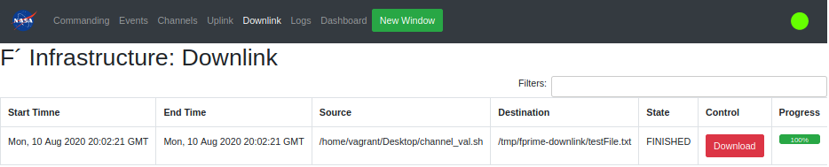

# A Brief Guide to the F´ Ground Data System

The F´ Ground Data System (GDS) was built to aid in the usage, development, test, and integration of F´-based embedded
systems. It was designed for projects that have not already chosen a GDS, for developers who need to test before the
project's GDS is fully online, and for integration testers who wish to automate tests against F´ software. This guide
will give you a quick introduction to what the F´ GDS is and how you can use it.

- [What is the GDS?](#what-is-the-gds)
- [Getting Started](#getting-started)
    - [Running the GDS](#running-the-gds)
- [GDS Options](#gds-options)
    - [Specify the Deployment or Dictionary](#specify-the-deployment-or-dictionary)
    - [Disable Automatic Flight Software Execution](#disable-automatic-flight-software-execution)
    - [Specify GDS Addresses and Ports](#specify-gds-addresses-and-ports)
    - [Run the GDS Without a UI](#run-the-gds-without-a-ui)
    - [Help and Other Options](#help-and-other-options)
- [Navigating the GDS GUI](#navigating-the-gds-gui)
    - [Commanding](#commanding)
    - [Events](#events)
    - [Channels](#channels)
    - [Uplink](#uplink)
    - [Downlink](#downlink)
    - [Logs](#logs)
    - [Dashboard](#dashboard)
- [Conclusion](#conclusion)


## What is the GDS?

A GDS is the "Ground Data System" that supports large-scale embedded systems by allowing operators to interact with the
embedded system. This system is typically used with spacecraft to facilitate control and monitoring of those systems'
flight software. Any data being sent from a ground computer to the spacecraft, or vice versa, has to pass through a GDS.

The F´ GDS provides this capability out-of-the-box to developers and projects using F´. This means that functions
traditionally performed through the GDS like systems testing, operation testing, and developer debugging can happen
as soon as F´ is installed. This frees users of F´ to quickly get started on processes that usually occur at the end of
the project even if a different GDS will eventually be used.

The rest of this guide will talk about how to use the built-in F´ GDS. Let's take a look!

**Note:** The `Ref` application will be used as the flight software for exploring the GDS.  It will work with your
project too!

## Getting Started

The F´ GDS is a minimal amount of Python code and JavaScript that is automatically installed when you run the F´
installation instructions in the [installation guide](../../INSTALL.md). This guide will walk the user through running
the GDS, setting options, and letting the user loose to run the system.


### Running the GDS

To start the GDS with the default settings (IP adapter, default ports, loading the default dictionary for the project),
navigate to the project directory and run `fprime-gds`. This will launch both the `Ref` flight software and the GDS layer along with the browser pointed at the GDS.

```bash
$ cd fprime/Ref
$ fprime-gds
```

**Note:** Ensure the virtual environment has been activated.  Consult the installation guide for more information.

`Ref` is just an example application that comes with F´; you can run `fprime-gds` in any deployment project folder. For
this to work properly, the user must build and install the `Ref` application using `fprime-util`.

By default, the `fprime-gds` command uses the current deployment to find the dictionary and the flight software to run.
The dictionary is used for the GDS to understand the events, channels, and commands produced by the embedded system and
the software is run as a convenience for local testing (`-n` will disable this feature).

In the following sections, we will explore various options for using the GDS.

## GDS Options

While fine for basic testing, you may want to change the operation of the GDS to meet project needs. Here are a few
common scenarios where most users will want to modify the operation.

To learn the F´ GDS UI, [skip to this section](#navigating-the-gds-gui).

### Specify the Deployment or Dictionary

By default, the GDS will try to use the current working directory to find the deployment or dictionary it needs to run.
If a user wants to specify the deployment, specify the `-d DEPLOY_DIR` option. This can be run from anywhere and does
not require `cd`.

```bash
$ fprime-gds -d path/to/deployment
```

The GDS does not need to automatically run flight software (see next section) and thus doesn't strictly need a full
deployment directory.  The user can simply specify the `--dictionary` for basic operations. **Note:** the GDS logs will
be placed in the user's home directory when the `-d`/`--deploy` flag isn't set.

```bash
$ fprime-gds -n --dictionary path/to/dictionary/xml
```

**Note:** `-n` is described below.

### Disable Automatic Flight Software Execution

By default, starting the GUI will also execute any native build of the deployments' F´ flight software instance. Often,
this becomes unnecessary as testing migrates to the embedded system. This automatic execution can be disabled by
supplying the `-n` flag. This also means the GDS is not required to be supplied a `-d`/`--deploy` flag, and the user can
run it with just the `--dictionary` and `-l`/`--log` flags.

```bash
$ fprime-gds -n
```

### Specify GDS Addresses and Ports

By default, the GDS runs on the local machine and uses the following local addresses and ports:

- **127.0.0.1:5000**: Hosts the HTML frontend. The browser connects here to access the GUI.
- **0.0.0.0:50000**: The default communication interface port. The embedded system connects here.
- **0.0.0.0:50050**: An internal port used for transporting GDS data. Communication and HTML endpoints internally connect here.

If a user wishes to change the IP address and port used to allow the embedded system to connect to the GDS, the user
should specify the `--ip-address ADDRESS` and `--ip-port PORT` flag. **Note:** These options are only available when
using the default IP connector.

```bash
$ fprime-gds --ip-address 8.8.8.8 --ip-port 12345
```

If you need to change the IP or port of the internal server, you can do so by passing the `--tts-addr IP_ADDRESS` and
`--tts-port TTS_PORT` options, respectively. This allows the user to avoid collisions with other ports.

```bash
$ fprime-gds --tts-addr 8.8.8.8 --tts-port 12345
```

Changing the port used by the UI is done using the flask configuration by setting the `ADDRESS` and `PORT` settings in
the `gds.ini` file. This file can be set with the `-c` flag. The `ADDRESS` or `PORT` environment variables can also be
set to modify these variables.

### Run the GDS Without a UI

In some cases, the user may wish to run the GDS without the HTML/browser UI loading. This can be done using the
`-g none` flag. This is usually done when running automatic integration testing, or using the [`fprime-cli`](gds-cli.md)
tool to operate without a UI.

```bash
$ fprime-gds -g none
```

### Help and Other Options

To see the full list of options you have when running the `fprime-gds` command, use the `--help` flag. e.g.
`fprime-gds --help`. The following are the currently available options:

```
fprime-gds --help
usage: fprime-gds [-h] [-d DEPLOY] [-l LOGS] [--log-directly] [-g {none,html}]
                  [--dictionary DICTIONARY] [-c CONFIG] [--tts-port TTS_PORT]
                  [--tts-addr TTS_ADDR] [-n] [--app APP]
                  [--ip-address ADDRESS] [--ip-port PORT]
                  [--comm-adapter {ip}]

Run F prime deployment and GDS

optional arguments:
  -h, --help            show this help message and exit
  -d DEPLOY, --deployment DEPLOY
                        Deployment directory for detecting dict, app, and
                        logging. [default: /Users/mstarch]
  -l LOGS, --logs LOGS  Logging directory. Created if nonexistent. Default:
                        deployment directory.
  --log-directly        Logging directory is used directly, no extra dated
                        directories are created.
  -g {none,html}, --gui {none,html}
                        Set the desired GUI system for running the deployment.
                        [default: html]
  --dictionary DICTIONARY
                        Path to dictionary. Overrides deploy if both are set
  -c CONFIG, --config CONFIG
                        Configuration for wx GUI. Ignored if not using wx.
  --tts-port TTS_PORT   Set the threaded TCP socket server port [default:
                        50050]
  --tts-addr TTS_ADDR   set the threaded TCP socket server address [default:
                        0.0.0.0]
  -n, --no-app          Do not run deployment binary. Overrides --app.
  --app APP             Path to app to run. Overrides deploy if both are set.
  --ip-address ADDRESS  Address of the IP adapter server. Default: 0.0.0.0
  --ip-port PORT        Port of the IP adapter server. Default: 50000
  --comm-adapter {ip}   Adapter for communicating to flight deployment.
                        [default: ip]
```

## Navigating the GDS GUI

When running the GDS using the default UI, the GDS should launch a browser tab that looks similar to the following. In
general, the available tabs are listed across the top and each view can be selected by clicking on those tabs.


Across the top of the screen is a series of tabs: "Commanding", "Events", etc. Each of those tabs represents a piece of
the GDS's functionality. Each view opens when you click on it. Next, we'll go through each tab's functions in more
detail in upcoming sections.

To the right of those tabs is a "New Window" button. If you want to open a new GUI window to view multiple tabs at once
click that button. This new window will connect to the same backend as the first window.

At the very top-right, there should be a green circle or a red X representing the GUI's connection status. A green
circle means that data is still flowing from the embedded system, while a red X means the embedded system is currently
disconnected and not sending/receiving any data. This is reset to an X via timeout, so you may need to configure that
timeout in the `config.js` file.  This widget is fondly referred to as "the orb" as it quickly shows if there is data
flow from the embedded F´ system.

There's also a NASA logo on the far left. It doesn't do anything right now, but hopefully, the meatball continues to
inspire our users. This logo is also configurable in `config.js`.

The tabs across the top perform most of the functionality of the GDS. What do the tabs contain? Do they contain things?
Let's find out!

### Commanding

The commanding tab contains the items needed to send commands to the embedded system. All available commands are listed
in the "Mnemonic" dropdown box, in the form `<COMPONENT>.<COMMAND>`. The commands are found in the dictionary supplied
to the GDS.  The user may select a command from the dropdown or type to filter the available commands. If the selected
command requires any arguments, they'll appear below the dropdown where the values may be entered. Invalid argument
inputs will be outlined in red. When clicked, the "Send Command" button will transmit the selected command and input
arguments through the GDS and to the embedded system, while "Clear Arguments" will reset the arguments inputs
to their default values.  Should an error occur in the GDS, it will be shown below the inputs.  The commanding tab is
shown below. See: [Commands](../user/cmd-evt-chn-prm.md#commands)


Below the command input is the "Command History" table. This records all the commands sent with their associated
arguments. This is recorded by the GDS and thus may include commands that did not transmit all the way to the embedded
system in case of communication error or other events. To search for commands, you can type something into the "Filters"
box and type enter, which displays only matching results. You can sort the rows by one of the table headers
(e.g. "Command Time") by clicking on that header. Double-clicking a historical command will re-populate the command
sending component and is useful to retry the transmission of a command.

### Events

The Events tab will display a table of all the "Events" that have happened on the embedded system and been received by
the GDS. See: [Events](../user/cmd-evt-chn-prm.md#events). The Events tab is shown below.


Each event is color-coded based on its "Event Severity;" there are 7 different kinds of severities:

| Severity | Color | Description |
|---|---|---|
| DIAGNOSTIC  |        | Debug events not typically sent to the GDS |
| COMMAND     | GREEN  | Events produced by the command dispatcher to aid in tracing actual command execution |
| ACTIVITY_LO | GRAY   | Low priority informational events typically tracking background process actions      |
| ACTIVITY_HI | BLUE   | High-priority informational events typically tracking ground-commanded foreground actions |
| WARNING_LO  | YELLOW | Low priority non-critical warning events |
| WARNING_HI  | ORANGE | High priority critical warning events |
| FATAL       | RED    | Critical failure event typically resulting in embedded system restart |

Just like the "Command History" table, these items can all be filtered and sorted based on the column headers.
Additionally, a "Clear" button will clear the table thus making the monitoring of new events easier. There is special
support for COMMAND event types, which will replace the opcode with the command mnemonic to help the user.  The opcode
can be found by hovering over the mnemonic and a tooltip will appear.

### Channels

The Channels tab displays an updating table of the latest "Channels", or telemetry data, the GDS has received from the
embedded system. These represent the latest values and, by default, only telemetry channels that have been received
by the GDS are shown. Channels with no received value are not displayed but can be configured (described below). Only
the most recently received value for each channel is shown. This view can be seen below.


If you want to view a full list of all available channels, set a view to watch specific channels, or monitor all
channels even those which have not arrived, you can click on the "Edit View". This will show all available channels
and allows users to tick the checkbox next to a channel that should be shown. Any unchecked channels will be hidden.
To apply the view, click the "Done".  Import and Export allow downloading and uploading text files that represent these
views such that they may be saved. The "Edit View" is shown below.


Just like the other tables, you can sort or filter these channel items.

### Uplink

The uplink tab allows users to upload files to the embedded system. This is dependent on the usage of the FileUplink
components and a file system implementation. The uplink process has two steps: staging and uplink. First, the user
browses for files to uplink to the system.  This submits the files to a working set and allows them to curate that set
before committing to an uplink. Finally, the user should press the "Submit Uplink" button to upload the files to the GDS,
add them to the outgoing queue, and start the uplink.  Uplink progress can be monitored and the queue can be paused to
temporarily stop the uplink. Files are limited to no more than 32Mb.


### Downlink

The downlink tab monitors the downlink of files into the GDS. Any files that have been downlinked using the
`fileDownlink.FileDownlink_SendFile` command will be tracked in this tab once the packets arrive in the F´ GDS. The
progress of this download is tracked, and once the file has been downlinked, the user has the ability to download the files.



### Logs

The logs tab allows the user to monitor logs produced on-disk by the GDS. This is a convenience to allow the user to
see those without going to the GDS server's ground system. Select a log from the list to see its contents, which update
in real time.


There are several standard logs that appear:
- `ThreadedTCP.log`: log from the GDS middleware server linking comm to the GDS actual
- `channel.log`: log of all channels received by the GDS
- `command.log`: log of all commands sent by the GDS
- `event.log`: log of all events received by the GDS

In addition, if the GDS automatically ran flight software, its log will appear here.  Any downlinking files will also
produce logs available to this tab.

### Dashboard

The dashboard lets users combine the tools from the other tabs onto a single screen, designing their own custom
interface for working with the GDS. You can learn more about how this works in the
[Dashboard guide](./gds-custom-dashboards.md).  An example is shown below:


## Conclusion

This guide walked the user through running the GDS and navigating the GDS UI. While the GUI can handle everything
you need for the GDS, it's certainly not required to use it, and some users might prefer a command-line interface for
certain tasks. You can learn more about how to do this through the [GDS CLI guide](./gds-cli.md).