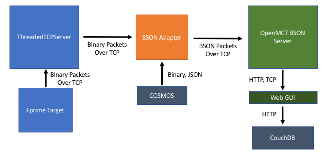

# Fprime OpenMCT Server

Author: Aaron Doubek-Kraft, aaron.doubek-kraft@jpl.nasa.gov
(or aarond.k.13@gmail.com after Summer 2018)

## Overview

The fprime OpenMCT server expands on OpenMCT's BSON Telemetry server to provide visualizations for fprime binary data streams. For an overview of OpenMCT, a web framework for building mission control applications being developed at NASA Ames Research Center, go to https://nasa.github.io/openmct/. The BSON server, also developed by the Ames team, is described in detail in the "BSON Telemetry Server" section.

## Architecture


The OpenMCT server consumes a stream of BSON data, publishes it to
clients in real time, and stores it in a database for later historical access.
This deployment runs an adapter to convert fprime binary packets to BSON in the format required by the BSON server. It also provides utility scripts to configure OpenMCT to work with fprime applications and interact with associated web services. All available scripts are explained in the "NPM Scripts" section.

The BSON server has also been extended to include an embedded database using LevelDB,
 which allows users to save and load custom layouts. The OpenMCT client is configured to use
the embedded database by default for convenience, but other options are available. In particular,
instructions on how to set up a CouchDB server and configure OpenMCT to use CouchDB as the
 persistence backend are included in this document. CouchDB requires running a
  separate service, but it is well tested and known to be reliable.

## Usage
This package requires node.js (8.11.3 is known to work: 10.x causes build issues) and npm (5.6 is known to work) to be installed on your system to build and run (https://nodejs.org/en/).
Additionally, the build scripts depend on Python autocoders, make sure your Python environment is set up as required by fprime (Python 2.7, modules from `/requirements.txt` installed).

To configure and start the OpenMCT server, run the following from fprime/openmct:
```
npm install
npm run configure <Topology XML Filepath>
npm start <Deployment Name>
```
where `<Topology XML Filepath>` is the Topology XML file for the fprime deployment for which OpenMCT will be receiving data, and `<Deployment Name>` is the name of this deployment as defined in the XML. Point a browser to http://localhost:8000 to view the OpenMCT web client (Chrome works best).
If configuration was successful, a Packet object called "[Deployment Name] Telemetry"
containing Telemetry objects for each channel should appear under the "BSON Server" folder.

The BSON server folder also contains a "LIMIT_LOG" object, which records all limit violations in all channels.
The fprime server generates additional resources on startup, which can be found in the "Resources" folder. These are:
 1. A "Latest Values Table" object which shows the most recent value and timestamp for all telemetry items.
 2. A "Channel Overlay Plot" object which contains any channels provided as argument to
 the `start` script.
 3. An "Event Log" objects which shows the formatted output of all EVRs.

OpenMCT allows the user to create custom objects, which will automatically be persisted to the embedded database by default, or to CouchDB
if it is configured.

### NPM Scripts
```
npm install
```
This script downloads all the JavaScript packages that the server depends on to
the `node_modules` directory. Dependencies and other project metadata are listed
in the `package.json` file. This script may take a few minutes to run, as it downloads
and installs many dependencies.

```
npm run configure <Topology XML Filepath>
```
First runs the autocoder at `Autocoders/Python/bin/JSONDictonaryGen.py`, which generates
a dictionary in JSON format for the given deployment XML, then runs the Node.js script at
`openmct/scripts/generateConfigJSON.js` to generate the configuration that defines dictionaries for
the OpenMCT server. For example, to configure the server for
the Ref application, run `npm run configure ../Ref/Top/RefTopologyAppAi.xml`.

```
npm start <Deployment Key> [Channels ...]
```
Starts the OpenMCT telemetry server, web client server, and BSON Adapter, using
the configuration files generated by `configure` for the given deployment. If configuration
hasn't been generated, the this script will print a list of the available deployments
and exit. By default the web client is served on http://localhost:8000. The
BSON Adapter will continuously attempt to connect to the fprime telemetry server
until it is running. By default,  it attempts to connect on http://localhost:50000.
To start the server configured for the Ref app, run `npm start Ref`.

The optional channel arguments will generate an overlay plot object in the 'Resources'
folder, using the channel names provided as space-separated arguments. Channels are
name as simply `<Channel Name>` if there is only one instance of a given component type,
or `<Instance Name>_<Channel Name>` if more than one instance exists in the system.

```
npm start debug <Deployment Key> [Channels ...]
```
Same as `start`, but with debugging flags enabled. Overview of how to use the
node.js debugger is [here](https://nodejs.org/api/debugger.html).

```
npm run clean
```
Removes configuration files generated by the build scripts. Use this to clean up
all generated resources and start from scratch.

```
npm run couchdb-get
```
Queries the CouchDB HTTP API and constructs a JSON document (`res/couchDBData.json` by default)
representing all user-created objects saved to the CouchDB server.
This document will be used to upload these objects when running `couchdb-set`.
This command will not work if the CouchDB server is not running at the domain
specified in 'config.js'.

```
npm run couchdb-set
```
Uses the CouchDB HTTP API to send local objects stored in `res/couchDBData.json`
to the server. The repository contains a sample JSON file
which will upload an "About OpenMCT" Webpage object to the database.
This command will not work if the CouchDB server is not running
at the domain specified in 'config.js'.

```
npm run read-cosmos-log <COSMOS Log File>
```
Runs the script at `scripts/deserialize_cosmos_binary.js`, which reads the binary COSMOS log file specified as an argument, opens a socket to the
OpenMCT telemetry server's BSON input port, and sends the data as a stream
of BSON packets. The data will be stored in the telemetry server, and will now be viewable by OpenMCT's historical plotting capabilities. COSMOS is a command and telemetry utility described [here](https://cosmosrb.com/),
and the binary logs it produces are documented [here](https://cosmosrb.com/docs/logging/).

## Directory Structure
The directories under `/openmct` have the following structure:

| Directory | Description |
| --- | --- |
| client/ | Front-end OpenMCT web application. The contents of this directory are served by the Telemetry Server: the entry point is `index.html`. Plugins included with the OpenMCT server are also located here.
| client/plugins/ | Custom plugins for the fprime server are located here. |
| client/plugins/FprimeResourceProvider | Generates the custom resources generated in the 'Resources' folder on startup, including the Latest Values Table, Event Log, and Overlay Plot. |
| client/plugins/Persistence | Implements the PersistenceService interface in OpenMCT, allowing the client to use the server's embedded database for object persistence. |
| client/plugins/TelemStatusIndicator | Implements the telemetry status indicator plugin |
| client/plugins/VueLADTable | Implements the custom Latest Value Table object type |
| docs/ | Further documentation and presentations related to fprime OpenMCT server. |
| node_modules/ | Contains the JavaScript packages installed by the Node Package Manager (npm) |
| openmct-old/ | Contains the prototype OpenMCT server developed during summer 2017, and associated documentation. |
| res/ | Contains any resources generated by Autocoders and utility scripts. |
| scripts/ | Utility scripts for generating configuration and interacting with web services |
| src/ | OpenMCT BSON server, and F' BSON Adapter code. |
| src/routes | Contains Express classes for the OpenMCT server's routes. `persistence.js` contains the embedded database code. |
| src/util | Contains utility scripts for the server, including `deserialize-binary.js`, which is used to decode the F' binary stream. |
| telemdb/ | Historical telemetry files generated by LevelDB are stored here.|
| persistdb/ | Object persistence database files generated by LevelDB are stored here|

## Default Configuration

Configuration options for the BSON server are specified in the file 'config.js'. Options with a default value marked as \*autocoded\* should not be changed manually, or the server may stop working correctly. By default, the server is configured as follows (other configuration options are available, and documented in config.js):

| Option | Description| Default Value |
| --- | --- | --- |
| deployment | Name of deployment to use for dictionary and packet deserialization. | \*autocoded\* |
| pointsFileTemplate | Name of points configuration file, where ${deployment} will be replaced by the deployment name by the autocoder | res/${deployment}Points.json |
| packetsFileTemplate| Name of packets configuration file, where ${deployment} will be replaced by the deployment name by the autocoder | res/${deployment}Packets.json |
| dictionaryTemplate | Name of JSON dictionary file, where ${deployment} will be replaced by the deployment name by the autocoder| res/${deployment}Dictionary.json |
| client.host | Hostname where web client will be served | localhost |
| client.port | Port where web client will be served | 8000 |
| client.persistence.type | Service to use for object persistence | embedded |
| client.persistence.url | URL of object persistence database (only used for CouchDB or Elasticsearch, this is the default for CouchDB) | http://localhost:5984/openmct |
| dictionary.pointsFile | Dictionary configuration for OpenMCT client, autocoded configuration file is saved here | \*autocoded\* |
| dictionary.packetsFile | Dictionary configuration for OpenMCT client, autocoded configuration file is saved here | \*autocoded\* |
| input.type | Input type for openmct | bson |
| input.bindAddress | Hostname where BSON server listens for packets | 127.0.0.1 |
| input.port | Port where BSON server listens for packets | 12345 |
| binaryInput.bindAddress | Hostname where BSON Adapter will connect and receive binary packets | 127.0.0.1 |
| binaryInput.port | Port where BSON Adapter will connect and receive binary packets | 50000 |

## Fprime Binary
Specification used to deserialize fprime binary packets is located [here](openmct-old/docs/sdd.md#32-protocols).

## Embedded Database
The OpenMCT BSON server has been extended with a 'persistence' route, allowing
it to act as a persistence backend for an OpenMCT client. The database is implemented
using LevelDB (http://leveldb.org/), an efficient on-disk key-value store from Google.

The persistence HTTP API defines the following endpoints:

| Name | URL | Method | Success Response | Error Response |
| ---- | --- | ------ | ---------------- | -------------- |
| List | /persistence/ | GET | Code: 200 <br> Data: the available endpoints described as JSON |  |
| Get Object | /persistence/objects/:id | GET | Code: 200 <br> Data: {status: 'ok', value: The model of object with key :id as a JSON string} | Code: 404 <br> Reason: No object with key :id <br>Data: {status: 'error', reason: the error message} |
| Update Object | /persistence/objects/:id | PUT | Code: 201 | Code: 400 <br> Reason: Could not update object <br> Data: {status: 'error', reason: the error message} |
| Delete Object | /persistence/objects/:id | DELETE | Code: 200 | Code: 400 |
| List Deployments | /persistence/list/deployments | GET | Code: 200 <br> Data: {status: 'ok', value: An array of deployment names as strings}  | |
| List Objects | /persistence/list/objects | GET | Code: 200 <br> Data: {status: 'ok', value: An array of object keys as strings} |  | |  

The client implements a custom OpenMCT persistence plugin which interacts with
this database over HTTP.

## Object Persistence with CouchDB
The server includes an embedded database for convenience, but CouchDB is highly reliable
 and may be a better option if this server will be expected to handle many clients
 simultaneously.
Download the appropriate version for your system from http://couchdb.apache.org/,
then do the following to configure CouchDB to work with OpenMCT:
  1. Start the Apache CouchDB application
  2. In a browser, navigate to http://127.0.0.1:5984/_utils/ to open the GUI tools
      (this may happen automatically when you start CouchDB)
  3. Go to the Setup panel and choose "Configure a Single Node". You should be prompted to create an admin account.
  4. Choose a username and password, using "127.0.0.1" as the host, and the default port of 5984
  5. From the Databases panel, create a new database called "openmct"
  6. Go to Configuration->CORS, choose "Enable CORS", and add the domain on
    which the web client is served (http://localhost:8000 if running locally)
      to the allowed domains. CORS (Cross-Origin Resource Sharing) allows OpenMCT
      read and write access to the database.
  7. In the `openmct/config.js` file, under 'persistence', change the 'type'
    property to 'couchdb'

To test that this functionality is working, create a new item in the web client,
and save it to "My Items". Then, refresh the browser and observe that the item
is persisted.

## Other extensions
The BSON telemetry server has also been extended with additional HTTP routes
that enable the status indicator and pre-loaded overlay plots.

On startup, the server produces a configuration file at `res/channels.json`,
which is then retrieved by the client with a GET request to `channels.json`.
The file consists of a simple JSON object with a list of the channel names
to include in the plot.

Once the server is running, the realtime server at `routes/realtime.js` exposes
a simple status object. This object contains a 'status' field, which will have
a value of 'data' if realtime data has been received in the last 3 seconds,
and 'noData' otherwise, and a 'packetCount' field, which simply counts the number
of packets received during the server's lifetime. This object is retrieved by
a GET request to `realtime/status`.

# BSON Telemetry Server

This section describes the OpenMCT BSON server. It was originally written by
Pete Richards (this version is preserved in `README-BSON-SERVER.md`), and modified with deployment-specific clarification by Aaron Doubek-Kraft.
This information is not necessary to run the fprime server, but it is used internally
in the implementation of the BSON Adapter.

The BSON Server is a basic Open MCT server with a built in telemetry server. It
consumes a stream of BSON data, publishes it to clients in real time, and also
stores it in a database for historical access later.

It supports two different history stores-- an embedded store using LevelDB (just works out of the box) or a Redis based store. The fprime server is configured to use LevelDB. Redis must be
run as a standalone service.

The dictionary server will automatically track new points as it sees them in
the telemetry stream and expose them for Open MCT.  You can also have the dictionary service persist the current known dictionary to a file by POSTing `dictionary/save`.  You can have it reload the dictionary from file by POSTing to `dictionary/load`. Using these routes shouldn't be necessary
with the fprime server, since the entire dictionary is defined up front.

All configuration options for the BSON telemetry server are contained in `config.js` with documentation.
The Node.js application entry point is `index.js`.

## Point and Packet Dictionary
In OpenMCT, a 'telemetry point' refers to a source of telemetry that is exposed
as an OpenMCT telemetry object, while a 'packet' is a group of points. Points
correspond to channels in fprime, and all channels from a particular deployment
are grouped into a single packet.

In order to provide Open MCT with the necessary information about available
points, point and packet dictionaries must be defined, and every point
must be mapped to a packet for it to be exposed in the client.
By default, the server will automatically create and populate point and packet dictionaries
based on the information it gleans from the realtime stream.

Automatic packet generation can be customized.  Additionally, point to packet
mappings can be defined manually. In the fprime server, configuration for
point and packet mappings is generated by the autocoder.

You can ask the server to persist it's current dictionaries to file via a POST
to the `/dictionary/save` endpoint.  The server will reload these files at
start up.  If you make changes to these files and want to reload them without
restarting the server, POST to `/dictionary/load`.

### Automatic point generation

The server will read type information from the bson messages stream and
automatically create point defintions for every unique mnemonic name.  These
can be manually edited by editing `res/points.json`.

### Automatic packet generation

There are three methods for automated packet generation.

**packetSeparator**
With no changes, the adapter will automatically detect packet names by splitting
point names using the `packetSeparator`.  It will only split on the first
`packetSeparator` found-- there is no concept of a nested packet. If the
`packetSeparator` is not found in the point name, then the adapter will add the
point to the "UNGROUPED POINTS" packet.

**packetPrefix**
You can specify a list of prefixes to group points by.  If more than one prefix
matches a point, the first match will be used for grouping.  If no matching
prefix is found, the server will fall back to the `packetSeparator` grouping
method above.

**manually editing packets.json**
You can modify the `res/packets.json` file to specify which points each packet
contains. This file is generated automatically for a particular deployment by the autocoder. If a point is not found in the packets file, then the system will
fallback to the `packetPrefix` grouping method above.

## BSON output via socket

The BSON output module generates BSON messages which are output via a user-defined socket. The BSON specification can be found on http://bsonspec.org/

### BSON message format.

field name | description
--- | ---
name | A string containing the name of the mnemonic of this sample.
flags | An unsigned integer of the flags associated with the mnemonic sample. See the mnemonic flags table for decoding the flags value.
timestamp | A date value of the timestamp of this mnemonic sample. The date value is with respect to the UNIX epoch.
raw_type | An integer identifier of the type of the raw_value. See the value type identifier table for possible values.
raw_value | The raw value of the mnemonic sample.
eng_type | An integer identifier of the type of the eng_value. This key/value pair is only present if the mnemonic has a defined conversion. See the value type identifier table for possible values.
eng_val | The engineering value of the mnemonic sample. This key/value pair is only present if the mnemonic has a defined conversion.


### Mnemonic flags

flag | meaning
--- | ---
0x80000000 | Flag indicating mnemonic value has been set.
0x40000000 | The mnemonic value is static.
0x20000000 | The mnemonic value is of questionable quality.
0x04000000 | Flag indicating a conversion is enabled for the mnemonic.
0x02000000 | Flag indicating limit checking is enabled for the mnemonic.
0x01000000 | Flag indicating delta limit checking is enabled for the mnemonic.
0x00200000 | Flag indicating the mnemonic value sample triggered a delta limit violation.
0x00100000 | Flag indicating the mnemonic is in the red-high state of limit violation.
0x00080000 | Flag indicating the mnemonic is in the red-low state of limit violation.
0x00040000 | Flag indicating the mnemonic is in the yellow-high state of limit violation.
0x00020000 | Flag indicating the mnemonic is in the yellow-low state of limit violation.
0x00010000 | Flag indicating the mnemonic is within limits.
0x00008000 | Flag indicating the most recent limit transition was a red-high violation.
0x00004000 | Flag indicating the most recent limit transition was a red-low violation.
0x00002000 | Flag indicating the most recent limit transition was a yellow-high violation.
0x00001000 | Flag indicating the most recent limit transition was a yellow-low violation.
0x00000800 | Flag indicating the most recent limit transition was back within limits.
0x00000400 | Flag indicating the mnemonic is read-only.
0x00000200 | Flag indicating the mnemonic value is from a simulated source.

### Value type identifiers.

the docs appear incorrect.  I have experimentally checked and guessed what some values actually are.

documented value | experimental value | type
--- | --- | ---
63 | 71 | signed integer
64 | 72 | unsigned integer
65 | 73 | floating-point
66 | 74 | string
67 | 75 | time
68 | 76 | date
69 | 77 | raw (byte array)
