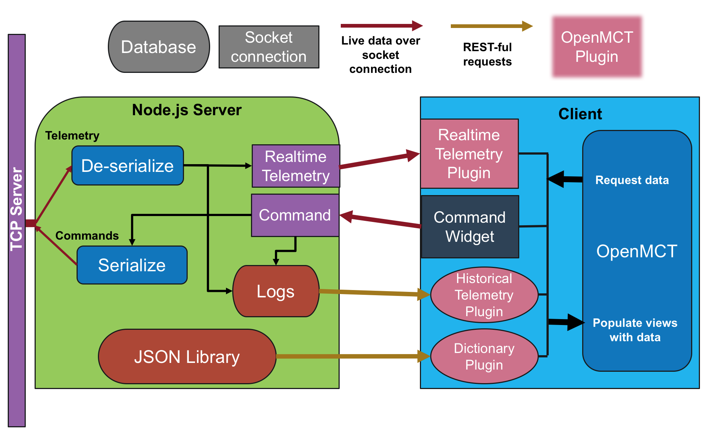

# Client - OpenMCT

by Sanchit Sinha
sinhasaeng@gmail.com


## 1. Introduction
User Guide is [here](#User Guide)!

The `client-openmct` module is used to interface with targets using a [Node.js](https://nodejs.org) server and [Open Source Mission Control Software](https://nasa.github.io/openmct/) developed by AMES Research center. A computer sets up an instance of the Node.js server while the usual TCP server and targets are running. Clients connect to the server through their web browser, preferebly [Google Chrome](https://www.google.com/chrome/)

![OpenMCT Client] (./res/img/PlotSS1.png)

## <a name="User Guide"></a>2. User Guide

You must first set the following values in 

[config.js](../config.js):

```
// Configure values for webapp

// Required
const target = 'ref';   		 // Target Name
const nodeSite = '127.0.0.1';  // Host to serve the single page application
const tcpSite = '127.0.0.1';   // Host of the TCP server
const tcpPort = 50000;  	    // Port for the TCP server

// Can keep as default
const staticPort = 8080;      // Port for single page application
const realTelemPort = 1337;   // Port streaming live telemetry datums to client
const commandPort = 1339;     // Port to listen for commands from client
```

These values are defaulted to running the ref target application.
Once finished, run the target and the TCP server. Then, run the following commands to setup and run the Node.js server.

```
npm install
npm start
```

Open a web browser and go go to `<nodeSite>:staticPort` to connect with your target.

Ref Example:
`localhost:8080`

## 3. Design

### 3.2 Protocols
The Node.js server serializes commands from the client to the TCP server and deserializes channel and event telemetry from a binary buffer to a datum object that OpenMCT can read.

There are nine types of format types used.

| Type | Description |
| :--: | :---------- |
| U8 | 8-bit Unsigned Integer |
| U16 | 16-bit Unsigned Integer |
| U32 | 32-bit Unsigned Integer |
| I8 | 8-bit Integer |
| I16 | 16-bit Integer |
| I32 | 32-bit Integer |
| F32 | 32-bit Floating Point Integer |
| Enum | Enumerated value with a I32 corresponding to a string |
| String | Each byte is a character. In byte buffers, strings are prepended with its length in a U32 <!--I think--> |

#### 3.2.1 Channel Telemetry

| Packet Component | Description | Type, Size (In bytes) |
| :--------------: | :---------- | :--: |
| Size | Size of packet starting at end of this buffer | U32 |
| Packet Descriptor | '1' Signifying channel telemetry | U32 |
| Channel ID | Identify channel and use as key in dictionary.json | U32 |
| Time Base | <!--??--> | U16 |
| Time Context | <!--??--> | U8 |
| Seconds | Epoch time in seconds when datum was sent from target | U32 |
| Microseconds | Epoch microseconds when datum was sent from target | U32 |
| Channel Value | Value of datum. Use dictionary.json to parse into string, enum, or number. | (Size - 19) |

#### 3.2.2 Event Telemetry

| Packet Component | Description | Type, Size (In bytes) |
| :--------------: | :---------- | :--: |
| Size | Size of packet starting at end of this buffer | U32 |
| Packet Descriptor | '2' Signifying event | U32 |
| Log ID | Identify event and use as key in dictionary.json. | U32 |
| Time Base | <!--??--> | U16 |
| Time Context | <!--??--> | U8 |
| Seconds | Epoch time in seconds when datum was sent from target | U32 |
| Microseconds | Epoch microseconds when datum was sent from target | U32 |
| Event args | Args to create event string. Use dictionary.json to parse into string, enum, or number. | (Size - 19) |

#### 3.2.3 Commands 

| Packet Component | Description | Type, Size (In bits) |
| :--------------: | :---------- | :--: |
| Header | 'A5A5 FSW ZZZZ' | String, (13 * 8) |
| Size | Size of packet starting at end of this buffer | U32 |
| Packet Descriptor | '0' Signifying command | U32 |
| Opcode | Identify event and use as key in dictionary.json. | U32 |
| Command args | Arguments for command. Types and formats are found in dictionary | (Size - 19) |
 
### 3.3 Context



This context diagram shows the different modules used for the server to communicate with the TCP Server and the Client.

| Component | Function |
| :-------: | :------- |
|[app.js](../server/app.js)| The Node.js server instance is ran off of this module. Values must be set here for setup. See the [User Guide](#User Guide) for more info. |
|[index.html](../index.html)| The html file of the [SPA](https://en.wikipedia.org/wiki/Single-page_application) that Node.js serves to the user. OpenMCT is imported referenced in this file and is also configured. Also, the fragment of html used for the command widget is written since no web loader, such as [require.js](http://requirejs.org/) is used. Values must also be set here to configure OpenMCT. |
|[telemetry-server.js](../server/src/telemetry-server.js)| Handles incoming telemetry. A netsocket recieves data from the TCP server | 
|[deserialize.js](../server/src/deserialize.js)| Parses data in buffer array into OpenMCT readable javascript object format. See the [User Guide](#User Guide) for more info. |
|./server/logs/telem-log.js| Saves parsed datums for historical telemetry views in OpenMCT. Directory and files created during start of Node.js server. |
|[historical-telem-plugin.js](../client/js/plugins/historical-telem-plugin.js)| Sends http requests to the server for OpenMCT to server historical telemetry data in its views. All http requests from client use [http.js](../client/js/http.js)|
|./server/src/res/dictionary.json | USed to store attributes for all channels, events, and commands. The backbone of argument parsing for all types of telemetry. Created on `npm start` using [json_dict.py](../bin/json_dict.py). |
|[dictionary-plugin.js](../client/js/plugins/dictionary-plugin.js)| Uses http requests to define the object structure of all channels and views in OpenMCT. | 
|[command-console.js](../client/js/plugins/command-console.js) | Uses [Vue.js](Vuejs.org) webwrapper to send commands over a socket server. |
|[command-server.js](../server/src/command-server.js)| Handles incoming commands from client using a listener. The commands are serialized into binary buffers and are sent to the TCP server.|
|[serialize.js](../server/src/serialize.js)| Uses the dictionary.json file to turn the command object into a binary buffer for the TCP server. |

### 3.4 Dictionary Object
The backbone of the entire app relies on the generated server/res/dictionary.js file. The client and the server both use this file to parse commands, setup OpenMCT, and more.

#### Format
```
{
	<{string}target name> : {
		"channels" : {
				"-1": {	// Always channel to stream events
                "component": null, 
                "description": "Events are shown here", 
                "format_string": null, 
                "id": -1, 
                "name": "Events", 
                "telem_type": "channel", 
                "type": "string"
             }, 
				<{string}channel id>: {
					"component": <{string}>,
					"description": <{string}>,
					"id": <{number} channel id>,
					"format_string": <{string} With only 1 python-type string modifier>,
					"limits": {
                    "high_orange": <{number}>, 
                    "high_red": <{number}>, 
                    "high_yellow": <{number}>, 
                    "low_orange": <{number}>, 
                    "low_red": <{number}>, 
                    "low_yellow": <{number}>
                 },
                 "name": <{string}>,
                 "telem_type": "channel",
                 "type": "Either integer-type or Enum",
                 {If "type"=Enum} "enum_dict": {
                 	<{string} integer key>: <{string} corresponding string>,
                 	...
                 },
                 "units": {can be null if none} [
                 	{
                 		"Gain": <{number}>
                 		"Label": <{string}>
                 		"Offset": <{number}>
                 	},
                 	...
                 ]
             },
             ...
       }
```
### 3.5 Future Work

* Database saved layouts (views) - using CouchDB and OpenMCT hooks
* Serializable telemetry items displayed
* Command widget:
```
1. Up/Down arrows to navigate history

2. Down arrow activited command list

3. Auto-complete

4. Date/Time tags in history (infrastructure there)

5. Perhaps use Vue list widget for history management
```

* Group channels by components
* Organize channel is alpha order
* Currently plotting units does not work - OpenMCT short coming
* Look into `requirejs` or `browserfy` for importing client side javascript modules. 

## 4. Platform Installation Notes

The client-openmct application connects to the Gse server via a nodejs application.  This has bee successfully run on Mac OSX and Ubuntu 16.0.2 machines.  You need nodejs version 8.4 and npm version 2.15.11 or greater.

## Mac Node and npm install:

For the Mac OS install both node and npm can be easially installed using mac ports, brew or directly from http://www.nodejs.org site.

## Ubuntu Node and npm install:

By default on ubuntu version 4.2.6 node is installed this is easy to fix though.   Here is what I did on a fresh ubuntu kernel running with all dependent Python packages already installed.  First I install node and npm by executing:

````
sudo apt-get update
sudo apt-get install nodejs
sudo apt-get install npm
````
This will install nodejs version 4.2.6 and npm version 3.5.2. Also note the executable for node is called `nodejs` and not `node` as we expect.   To upgrade to the latest stable release which is 8.4.0 do the following commands:

````
sudo npm cache clean -f
sudo npm install -g n
sudo n stable
sudo ln -sf /usr/local/n/versions/node/<VERSION>/bin/node /usr/bin/nodejs
````
Next type the following to see the following responses:

````
parallels@ubuntu:/usr/local/bin$ npm -v
5.3.0
parallels@ubuntu:/usr/local/bin$ node -v
v8.4.0
````
You should now be able to do the following successfully:

````
parallels@ubuntu:~/fprime-sw/Gse/client-openmct$ npm install

> fprime-client@0.0.1 postinstall /home/parallels/fprime-sw/Gse/client-openmct
> cd node_modules/openmct && npm install


> node-sass@3.13.1 install /home/parallels/fprime-sw/Gse/client-openmct/node_modules/openmct/node_modules/node-sass
> node scripts/install.js

Downloading binary from https://github.com/sass/node-sass/releases/download/v3.13.1/linux-x64-57_binding.node
Cannot download "https://github.com/sass/node-sass/releases/download/v3.13.1/linux-x64-57_binding.node": 

HTTP error 404 Not Found

Hint: If github.com is not accessible in your location
      try setting a proxy via HTTP_PROXY, e.g. 

      export HTTP_PROXY=http://example.com:1234

or configure npm proxy via

      npm config set proxy http://example.com:8080

> node-sass@3.13.1 postinstall /home/parallels/fprime-sw/Gse/client-openmct/node_modules/openmct/node_modules/node-sass
> node scripts/build.js

Building: /usr/local/bin/node /home/parallels/fprime-sw/Gse/client-openmct/node_modules/openmct/node_modules/node-gyp/bin/node-gyp.js rebuild --verbose --libsass_ext= --libsass_cflags= --libsass_ldflags= --libsass_library=
gyp info it worked if it ends with ok
gyp verb cli [ '/usr/local/bin/node',
gyp verb cli   '/home/parallels/fprime-sw/Gse/client-openmct/node_modules/openmct/node_modules/node-gyp/bin/node-gyp.js',
gyp verb cli   'rebuild',
gyp verb cli   '--verbose',
gyp verb cli   '--libsass_ext=',
gyp verb cli   '--libsass_cflags=',
gyp verb cli   '--libsass_ldflags=',
gyp verb cli   '--libsass_library=' ]
gyp info using node-gyp@3.6.2
gyp info using node@8.4.0 | linux | x64
gyp verb command rebuild []
gyp verb command clean []
gyp verb clean removing "build" directory
gyp verb command configure []
gyp verb check python checking for Python executable "python2" in the PATH
gyp verb `which` succeeded python2 /usr/bin/python2
gyp verb check python version `/usr/bin/python2 -c "import platform; print(platform.python_version());"` returned: "2.7.12\n"
gyp verb get node dir no --target version specified, falling back to host node version: 8.4.0
gyp verb command install [ '8.4.0' ]
gyp verb install input version string "8.4.0"
gyp verb install installing version: 8.4.0
gyp verb install --ensure was passed, so won't reinstall if already installed
gyp verb install version is already installed, need to check "installVersion"
gyp verb got "installVersion" 9
gyp verb needs "installVersion" 9
gyp verb install version is good
gyp verb get node dir target node version installed: 8.4.0
gyp verb build dir attempting to create "build" dir: /home/parallels/fprime-sw/Gse/client-openmct/node_modules/openmct/node_modules/node-sass/build
gyp verb build dir "build" dir needed to be created? /home/parallels/fprime-sw/Gse/client-openmct/node_modules/openmct/node_modules/node-sass/build
gyp verb build/config.gypi creating config file
gyp verb build/config.gypi writing out config file: /home/parallels/fprime-sw/Gse/client-openmct/node_modules/openmct/node_modules/node-sass/build/config.gypi
gyp verb config.gypi checking for gypi file: /home/parallels/fprime-sw/Gse/client-openmct/node_modules/openmct/node_modules/node-sass/config.gypi
gyp verb common.gypi checking for gypi file: /home/parallels/fprime-sw/Gse/client-openmct/node_modules/openmct/node_modules/node-sass/common.gypi
gyp verb gyp gyp format was not specified; forcing "make"
gyp info spawn /usr/bin/python2
gyp info spawn args [ '/home/parallels/fprime-sw/Gse/client-openmct/node_modules/openmct/node_modules/node-gyp/gyp/gyp_main.py',
gyp info spawn args   'binding.gyp',
gyp info spawn args   '-f',
gyp info spawn args   'make',
gyp info spawn args   '-I',
gyp info spawn args   '/home/parallels/fprime-sw/Gse/client-openmct/node_modules/openmct/node_modules/node-sass/build/config.gypi',
gyp info spawn args   '-I',
gyp info spawn args   '/home/parallels/fprime-sw/Gse/client-openmct/node_modules/openmct/node_modules/node-gyp/addon.gypi',
gyp info spawn args   '-I',
gyp info spawn args   '/home/parallels/.node-gyp/8.4.0/include/node/common.gypi',
gyp info spawn args   '-Dlibrary=shared_library',
gyp info spawn args   '-Dvisibility=default',
gyp info spawn args   '-Dnode_root_dir=/home/parallels/.node-gyp/8.4.0',
gyp info spawn args   '-Dnode_gyp_dir=/home/parallels/fprime-sw/Gse/client-openmct/node_modules/openmct/node_modules/node-gyp',
gyp info spawn args   '-Dnode_lib_file=/home/parallels/.node-gyp/8.4.0/<(target_arch)/node.lib',
gyp info spawn args   '-Dmodule_root_dir=/home/parallels/fprime-sw/Gse/client-openmct/node_modules/openmct/node_modules/node-sass',
gyp info spawn args   '-Dnode_engine=v8',
gyp info spawn args   '--depth=.',
gyp info spawn args   '--no-parallel',
gyp info spawn args   '--generator-output',
gyp info spawn args   'build',
gyp info spawn args   '-Goutput_dir=.' ]
gyp verb command build []
gyp verb build type Release
gyp verb architecture x64
gyp verb node dev dir /home/parallels/.node-gyp/8.4.0
gyp verb `which` succeeded for `make` /usr/bin/make
gyp info spawn make
gyp info spawn args [ 'V=1', 'BUILDTYPE=Release', '-C', 'build' ]
make: Entering directory '/home/parallels/fprime-sw/Gse/client-openmct/node_modules/openmct/node_modules/node-sass/build'
  g++ '-DNODE_GYP_MODULE_NAME=libsass' '-DUSING_UV_SHARED=1' '-DUSING_V8_SHARED=1' '-DV8_DEPRECATION_WARNINGS=1' '-D_LARGEFILE_SOURCE' '-D_FILE_OFFSET_BITS=64' '-DLIBSASS_VERSION="3.3.6"' -I/home/parallels/.node-gyp/8.4.0/include/node -I/home/parallels/.node-gyp/8.4.0/src -I/home/parallels/.node-gyp/8.4.0/deps/uv/include -I/home/parallels/.node-gyp/8.4.0/deps/v8/include -I../src/libsass/include  -fPIC -pthread -Wall -Wextra -Wno-unused-parameter -m64 -O3 -fno-omit-frame-pointer -std=gnu++0x -std=c++0x -fexceptions -frtti -MMD -MF ./Release/.deps/Release/obj.target/libsass/src/libsass/src/ast.o.d.raw   -c -o Release/obj.target/libsass/src/libsass/src/ast.o ../src/libsass/src/ast.cpp
  g++ '-DNODE_GYP_MODULE_NAME=libsass' '-DUSING_UV_SHARED=1' '-DUSING_V8_SHARED=1' '-DV8_DEPRECATION_WARNINGS=1' '-D_LARGEFILE_SOURCE' '-D_FILE_OFFSET_BITS=64' '-DLIBSASS_VERSION="3.3.6"' -I/home/parallels/.node-gyp/8.4.0/include/node -I/home/parallels/.node-gyp/8.4.0/src -I/home/parallels/.node-gyp/8.4.0/deps/uv/include -I/home/parallels/.node-gyp/8.4.0/deps/v8/include -I../src/libsass/include  -fPIC -pthread -Wall -Wextra -Wno-unused-parameter -m64 -O3 -fno-omit-frame-pointer -std=gnu++0x -std=c++0x -fexceptions -frtti -MMD -MF ./Release/.deps/Release/obj.target/libsass/src/libsass/src/base64vlq.o.d.raw   -c -o Release/obj.target/libsass/src/libsass/src/base64vlq.o ../src/libsass/src/base64vlq.cpp
  g++ '-DNODE_GYP_MODULE_NAME=libsass' '-DUSING_UV_SHARED=1' '-DUSING_V8_SHARED=1' '-DV8_DEPRECATION_WARNINGS=1' '-D_LARGEFILE_SOURCE' '-D_FILE_OFFSET_BITS=64' '-DLIBSASS_VERSION="3.3.6"' -I/home/parallels/.node-gyp/8.4.0/include/node -I/home/parallels/.node-gyp/8.4.0/src -I/home/parallels/.node-gyp/8.4.0/deps/uv/include -I/home/parallels/.node-gyp/8.4.0/deps/v8/include -I../src/libsass/include  -fPIC -pthread -Wall -Wextra -Wno-unused-parameter -m64 -O3 -fno-omit-frame-pointer -std=gnu++0x -std=c++0x -fexceptions -frtti -MMD -MF ./Release/.deps/Release/obj.target/libsass/src/libsass/src/bind.o.d.raw   -c -o Release/obj.target/libsass/src/libsass/src/bind.o ../src/libsass/src/bind.cpp
  cc '-DNODE_GYP_MODULE_NAME=libsass' '-DUSING_UV_SHARED=1' '-DUSING_V8_SHARED=1' '-DV8_DEPRECATION_WARNINGS=1' '-D_LARGEFILE_SOURCE' '-D_FILE_OFFSET_BITS=64' '-DLIBSASS_VERSION="3.3.6"' -I/home/parallels/.node-gyp/8.4.0/include/node -I/home/parallels/.node-gyp/8.4.0/src -I/home/parallels/.node-gyp/8.4.0/deps/uv/include -I/home/parallels/.node-gyp/8.4.0/deps/v8/include -I../src/libsass/include  -fPIC -pthread -Wall -Wextra -Wno-unused-parameter -m64 -O3 -fno-omit-frame-pointer  -MMD -MF ./Release/.deps/Release/obj.target/libsass/src/libsass/src/cencode.o.d.raw   -c -o Release/obj.target/libsass/src/libsass/src/cencode.o ../src/libsass/src/cencode.c
  g++ '-DNODE_GYP_MODULE_NAME=libsass' '-DUSING_UV_SHARED=1' '-DUSING_V8_SHARED=1' '-DV8_DEPRECATION_WARNINGS=1' '-D_LARGEFILE_SOURCE' '-D_FILE_OFFSET_BITS=64' '-DLIBSASS_VERSION="3.3.6"' -I/home/parallels/.node-gyp/8.4.0/include/node -I/home/parallels/.node-gyp/8.4.0/src -I/home/parallels/.node-gyp/8.4.0/deps/uv/include -I/home/parallels/.node-gyp/8.4.0/deps/v8/include -I../src/libsass/include  -fPIC -pthread -Wall -Wextra -Wno-unused-parameter -m64 -O3 -fno-omit-frame-pointer -std=gnu++0x -std=c++0x -fexceptions -frtti -MMD -MF ./Release/.deps/Release/obj.target/libsass/src/libsass/src/color_maps.o.d.raw   -c -o Release/obj.target/libsass/src/libsass/src/color_maps.o ../src/libsass/src/color_maps.cpp
  g++ '-DNODE_GYP_MODULE_NAME=libsass' '-DUSING_UV_SHARED=1' '-DUSING_V8_SHARED=1' '-DV8_DEPRECATION_WARNINGS=1' '-D_LARGEFILE_SOURCE' '-D_FILE_OFFSET_BITS=64' '-DLIBSASS_VERSION="3.3.6"' -I/home/parallels/.node-gyp/8.4.0/include/node -I/home/parallels/.node-gyp/8.4.0/src -I/home/parallels/.node-gyp/8.4.0/deps/uv/include -I/home/parallels/.node-gyp/8.4.0/deps/v8/include -I../src/libsass/include  -fPIC -pthread -Wall -Wextra -Wno-unused-parameter -m64 -O3 -fno-omit-frame-pointer -std=gnu++0x -std=c++0x -fexceptions -frtti -MMD -MF ./Release/.deps/Release/obj.target/libsass/src/libsass/src/constants.o.d.raw   -c -o Release/obj.target/libsass/src/libsass/src/constants.o ../src/libsass/src/constants.cpp
  g++ '-DNODE_GYP_MODULE_NAME=libsass' '-DUSING_UV_SHARED=1' '-DUSING_V8_SHARED=1' '-DV8_DEPRECATION_WARNINGS=1' '-D_LARGEFILE_SOURCE' '-D_FILE_OFFSET_BITS=64' '-DLIBSASS_VERSION="3.3.6"' -I/home/parallels/.node-gyp/8.4.0/include/node -I/home/parallels/.node-gyp/8.4.0/src -I/home/parallels/.node-gyp/8.4.0/deps/uv/include -I/home/parallels/.node-gyp/8.4.0/deps/v8/include -I../src/libsass/include  -fPIC -pthread -Wall -Wextra -Wno-unused-parameter -m64 -O3 -fno-omit-frame-pointer -std=gnu++0x -std=c++0x -fexceptions -frtti -MMD -MF ./Release/.deps/Release/obj.target/libsass/src/libsass/src/context.o.d.raw   -c -o Release/obj.target/libsass/src/libsass/src/context.o ../src/libsass/src/context.cpp
  g++ '-DNODE_GYP_MODULE_NAME=libsass' '-DUSING_UV_SHARED=1' '-DUSING_V8_SHARED=1' '-DV8_DEPRECATION_WARNINGS=1' '-D_LARGEFILE_SOURCE' '-D_FILE_OFFSET_BITS=64' '-DLIBSASS_VERSION="3.3.6"' -I/home/parallels/.node-gyp/8.4.0/include/node -I/home/parallels/.node-gyp/8.4.0/src -I/home/parallels/.node-gyp/8.4.0/deps/uv/include -I/home/parallels/.node-gyp/8.4.0/deps/v8/include -I../src/libsass/include  -fPIC -pthread -Wall -Wextra -Wno-unused-parameter -m64 -O3 -fno-omit-frame-pointer -std=gnu++0x -std=c++0x -fexceptions -frtti -MMD -MF ./Release/.deps/Release/obj.target/libsass/src/libsass/src/cssize.o.d.raw   -c -o Release/obj.target/libsass/src/libsass/src/cssize.o ../src/libsass/src/cssize.cpp
  g++ '-DNODE_GYP_MODULE_NAME=libsass' '-DUSING_UV_SHARED=1' '-DUSING_V8_SHARED=1' '-DV8_DEPRECATION_WARNINGS=1' '-D_LARGEFILE_SOURCE' '-D_FILE_OFFSET_BITS=64' '-DLIBSASS_VERSION="3.3.6"' -I/home/parallels/.node-gyp/8.4.0/include/node -I/home/parallels/.node-gyp/8.4.0/src -I/home/parallels/.node-gyp/8.4.0/deps/uv/include -I/home/parallels/.node-gyp/8.4.0/deps/v8/include -I../src/libsass/include  -fPIC -pthread -Wall -Wextra -Wno-unused-parameter -m64 -O3 -fno-omit-frame-pointer -std=gnu++0x -std=c++0x -fexceptions -frtti -MMD -MF ./Release/.deps/Release/obj.target/libsass/src/libsass/src/emitter.o.d.raw   -c -o Release/obj.target/libsass/src/libsass/src/emitter.o ../src/libsass/src/emitter.cpp
  g++ '-DNODE_GYP_MODULE_NAME=libsass' '-DUSING_UV_SHARED=1' '-DUSING_V8_SHARED=1' '-DV8_DEPRECATION_WARNINGS=1' '-D_LARGEFILE_SOURCE' '-D_FILE_OFFSET_BITS=64' '-DLIBSASS_VERSION="3.3.6"' -I/home/parallels/.node-gyp/8.4.0/include/node -I/home/parallels/.node-gyp/8.4.0/src -I/home/parallels/.node-gyp/8.4.0/deps/uv/include -I/home/parallels/.node-gyp/8.4.0/deps/v8/include -I../src/libsass/include  -fPIC -pthread -Wall -Wextra -Wno-unused-parameter -m64 -O3 -fno-omit-frame-pointer -std=gnu++0x -std=c++0x -fexceptions -frtti -MMD -MF ./Release/.deps/Release/obj.target/libsass/src/libsass/src/environment.o.d.raw   -c -o Release/obj.target/libsass/src/libsass/src/environment.o ../src/libsass/src/environment.cpp
  g++ '-DNODE_GYP_MODULE_NAME=libsass' '-DUSING_UV_SHARED=1' '-DUSING_V8_SHARED=1' '-DV8_DEPRECATION_WARNINGS=1' '-D_LARGEFILE_SOURCE' '-D_FILE_OFFSET_BITS=64' '-DLIBSASS_VERSION="3.3.6"' -I/home/parallels/.node-gyp/8.4.0/include/node -I/home/parallels/.node-gyp/8.4.0/src -I/home/parallels/.node-gyp/8.4.0/deps/uv/include -I/home/parallels/.node-gyp/8.4.0/deps/v8/include -I../src/libsass/include  -fPIC -pthread -Wall -Wextra -Wno-unused-parameter -m64 -O3 -fno-omit-frame-pointer -std=gnu++0x -std=c++0x -fexceptions -frtti -MMD -MF ./Release/.deps/Release/obj.target/libsass/src/libsass/src/error_handling.o.d.raw   -c -o Release/obj.target/libsass/src/libsass/src/error_handling.o ../src/libsass/src/error_handling.cpp
  g++ '-DNODE_GYP_MODULE_NAME=libsass' '-DUSING_UV_SHARED=1' '-DUSING_V8_SHARED=1' '-DV8_DEPRECATION_WARNINGS=1' '-D_LARGEFILE_SOURCE' '-D_FILE_OFFSET_BITS=64' '-DLIBSASS_VERSION="3.3.6"' -I/home/parallels/.node-gyp/8.4.0/include/node -I/home/parallels/.node-gyp/8.4.0/src -I/home/parallels/.node-gyp/8.4.0/deps/uv/include -I/home/parallels/.node-gyp/8.4.0/deps/v8/include -I../src/libsass/include  -fPIC -pthread -Wall -Wextra -Wno-unused-parameter -m64 -O3 -fno-omit-frame-pointer -std=gnu++0x -std=c++0x -fexceptions -frtti -MMD -MF ./Release/.deps/Release/obj.target/libsass/src/libsass/src/eval.o.d.raw   -c -o Release/obj.target/libsass/src/libsass/src/eval.o ../src/libsass/src/eval.cpp
  g++ '-DNODE_GYP_MODULE_NAME=libsass' '-DUSING_UV_SHARED=1' '-DUSING_V8_SHARED=1' '-DV8_DEPRECATION_WARNINGS=1' '-D_LARGEFILE_SOURCE' '-D_FILE_OFFSET_BITS=64' '-DLIBSASS_VERSION="3.3.6"' -I/home/parallels/.node-gyp/8.4.0/include/node -I/home/parallels/.node-gyp/8.4.0/src -I/home/parallels/.node-gyp/8.4.0/deps/uv/include -I/home/parallels/.node-gyp/8.4.0/deps/v8/include -I../src/libsass/include  -fPIC -pthread -Wall -Wextra -Wno-unused-parameter -m64 -O3 -fno-omit-frame-pointer -std=gnu++0x -std=c++0x -fexceptions -frtti -MMD -MF ./Release/.deps/Release/obj.target/libsass/src/libsass/src/expand.o.d.raw   -c -o Release/obj.target/libsass/src/libsass/src/expand.o ../src/libsass/src/expand.cpp
  g++ '-DNODE_GYP_MODULE_NAME=libsass' '-DUSING_UV_SHARED=1' '-DUSING_V8_SHARED=1' '-DV8_DEPRECATION_WARNINGS=1' '-D_LARGEFILE_SOURCE' '-D_FILE_OFFSET_BITS=64' '-DLIBSASS_VERSION="3.3.6"' -I/home/parallels/.node-gyp/8.4.0/include/node -I/home/parallels/.node-gyp/8.4.0/src -I/home/parallels/.node-gyp/8.4.0/deps/uv/include -I/home/parallels/.node-gyp/8.4.0/deps/v8/include -I../src/libsass/include  -fPIC -pthread -Wall -Wextra -Wno-unused-parameter -m64 -O3 -fno-omit-frame-pointer -std=gnu++0x -std=c++0x -fexceptions -frtti -MMD -MF ./Release/.deps/Release/obj.target/libsass/src/libsass/src/extend.o.d.raw   -c -o Release/obj.target/libsass/src/libsass/src/extend.o ../src/libsass/src/extend.cpp
  g++ '-DNODE_GYP_MODULE_NAME=libsass' '-DUSING_UV_SHARED=1' '-DUSING_V8_SHARED=1' '-DV8_DEPRECATION_WARNINGS=1' '-D_LARGEFILE_SOURCE' '-D_FILE_OFFSET_BITS=64' '-DLIBSASS_VERSION="3.3.6"' -I/home/parallels/.node-gyp/8.4.0/include/node -I/home/parallels/.node-gyp/8.4.0/src -I/home/parallels/.node-gyp/8.4.0/deps/uv/include -I/home/parallels/.node-gyp/8.4.0/deps/v8/include -I../src/libsass/include  -fPIC -pthread -Wall -Wextra -Wno-unused-parameter -m64 -O3 -fno-omit-frame-pointer -std=gnu++0x -std=c++0x -fexceptions -frtti -MMD -MF ./Release/.deps/Release/obj.target/libsass/src/libsass/src/file.o.d.raw   -c -o Release/obj.target/libsass/src/libsass/src/file.o ../src/libsass/src/file.cpp
  g++ '-DNODE_GYP_MODULE_NAME=libsass' '-DUSING_UV_SHARED=1' '-DUSING_V8_SHARED=1' '-DV8_DEPRECATION_WARNINGS=1' '-D_LARGEFILE_SOURCE' '-D_FILE_OFFSET_BITS=64' '-DLIBSASS_VERSION="3.3.6"' -I/home/parallels/.node-gyp/8.4.0/include/node -I/home/parallels/.node-gyp/8.4.0/src -I/home/parallels/.node-gyp/8.4.0/deps/uv/include -I/home/parallels/.node-gyp/8.4.0/deps/v8/include -I../src/libsass/include  -fPIC -pthread -Wall -Wextra -Wno-unused-parameter -m64 -O3 -fno-omit-frame-pointer -std=gnu++0x -std=c++0x -fexceptions -frtti -MMD -MF ./Release/.deps/Release/obj.target/libsass/src/libsass/src/functions.o.d.raw   -c -o Release/obj.target/libsass/src/libsass/src/functions.o ../src/libsass/src/functions.cpp
  g++ '-DNODE_GYP_MODULE_NAME=libsass' '-DUSING_UV_SHARED=1' '-DUSING_V8_SHARED=1' '-DV8_DEPRECATION_WARNINGS=1' '-D_LARGEFILE_SOURCE' '-D_FILE_OFFSET_BITS=64' '-DLIBSASS_VERSION="3.3.6"' -I/home/parallels/.node-gyp/8.4.0/include/node -I/home/parallels/.node-gyp/8.4.0/src -I/home/parallels/.node-gyp/8.4.0/deps/uv/include -I/home/parallels/.node-gyp/8.4.0/deps/v8/include -I../src/libsass/include  -fPIC -pthread -Wall -Wextra -Wno-unused-parameter -m64 -O3 -fno-omit-frame-pointer -std=gnu++0x -std=c++0x -fexceptions -frtti -MMD -MF ./Release/.deps/Release/obj.target/libsass/src/libsass/src/inspect.o.d.raw   -c -o Release/obj.target/libsass/src/libsass/src/inspect.o ../src/libsass/src/inspect.cpp
  g++ '-DNODE_GYP_MODULE_NAME=libsass' '-DUSING_UV_SHARED=1' '-DUSING_V8_SHARED=1' '-DV8_DEPRECATION_WARNINGS=1' '-D_LARGEFILE_SOURCE' '-D_FILE_OFFSET_BITS=64' '-DLIBSASS_VERSION="3.3.6"' -I/home/parallels/.node-gyp/8.4.0/include/node -I/home/parallels/.node-gyp/8.4.0/src -I/home/parallels/.node-gyp/8.4.0/deps/uv/include -I/home/parallels/.node-gyp/8.4.0/deps/v8/include -I../src/libsass/include  -fPIC -pthread -Wall -Wextra -Wno-unused-parameter -m64 -O3 -fno-omit-frame-pointer -std=gnu++0x -std=c++0x -fexceptions -frtti -MMD -MF ./Release/.deps/Release/obj.target/libsass/src/libsass/src/json.o.d.raw   -c -o Release/obj.target/libsass/src/libsass/src/json.o ../src/libsass/src/json.cpp
  g++ '-DNODE_GYP_MODULE_NAME=libsass' '-DUSING_UV_SHARED=1' '-DUSING_V8_SHARED=1' '-DV8_DEPRECATION_WARNINGS=1' '-D_LARGEFILE_SOURCE' '-D_FILE_OFFSET_BITS=64' '-DLIBSASS_VERSION="3.3.6"' -I/home/parallels/.node-gyp/8.4.0/include/node -I/home/parallels/.node-gyp/8.4.0/src -I/home/parallels/.node-gyp/8.4.0/deps/uv/include -I/home/parallels/.node-gyp/8.4.0/deps/v8/include -I../src/libsass/include  -fPIC -pthread -Wall -Wextra -Wno-unused-parameter -m64 -O3 -fno-omit-frame-pointer -std=gnu++0x -std=c++0x -fexceptions -frtti -MMD -MF ./Release/.deps/Release/obj.target/libsass/src/libsass/src/lexer.o.d.raw   -c -o Release/obj.target/libsass/src/libsass/src/lexer.o ../src/libsass/src/lexer.cpp
  g++ '-DNODE_GYP_MODULE_NAME=libsass' '-DUSING_UV_SHARED=1' '-DUSING_V8_SHARED=1' '-DV8_DEPRECATION_WARNINGS=1' '-D_LARGEFILE_SOURCE' '-D_FILE_OFFSET_BITS=64' '-DLIBSASS_VERSION="3.3.6"' -I/home/parallels/.node-gyp/8.4.0/include/node -I/home/parallels/.node-gyp/8.4.0/src -I/home/parallels/.node-gyp/8.4.0/deps/uv/include -I/home/parallels/.node-gyp/8.4.0/deps/v8/include -I../src/libsass/include  -fPIC -pthread -Wall -Wextra -Wno-unused-parameter -m64 -O3 -fno-omit-frame-pointer -std=gnu++0x -std=c++0x -fexceptions -frtti -MMD -MF ./Release/.deps/Release/obj.target/libsass/src/libsass/src/listize.o.d.raw   -c -o Release/obj.target/libsass/src/libsass/src/listize.o ../src/libsass/src/listize.cpp
  g++ '-DNODE_GYP_MODULE_NAME=libsass' '-DUSING_UV_SHARED=1' '-DUSING_V8_SHARED=1' '-DV8_DEPRECATION_WARNINGS=1' '-D_LARGEFILE_SOURCE' '-D_FILE_OFFSET_BITS=64' '-DLIBSASS_VERSION="3.3.6"' -I/home/parallels/.node-gyp/8.4.0/include/node -I/home/parallels/.node-gyp/8.4.0/src -I/home/parallels/.node-gyp/8.4.0/deps/uv/include -I/home/parallels/.node-gyp/8.4.0/deps/v8/include -I../src/libsass/include  -fPIC -pthread -Wall -Wextra -Wno-unused-parameter -m64 -O3 -fno-omit-frame-pointer -std=gnu++0x -std=c++0x -fexceptions -frtti -MMD -MF ./Release/.deps/Release/obj.target/libsass/src/libsass/src/memory_manager.o.d.raw   -c -o Release/obj.target/libsass/src/libsass/src/memory_manager.o ../src/libsass/src/memory_manager.cpp
  g++ '-DNODE_GYP_MODULE_NAME=libsass' '-DUSING_UV_SHARED=1' '-DUSING_V8_SHARED=1' '-DV8_DEPRECATION_WARNINGS=1' '-D_LARGEFILE_SOURCE' '-D_FILE_OFFSET_BITS=64' '-DLIBSASS_VERSION="3.3.6"' -I/home/parallels/.node-gyp/8.4.0/include/node -I/home/parallels/.node-gyp/8.4.0/src -I/home/parallels/.node-gyp/8.4.0/deps/uv/include -I/home/parallels/.node-gyp/8.4.0/deps/v8/include -I../src/libsass/include  -fPIC -pthread -Wall -Wextra -Wno-unused-parameter -m64 -O3 -fno-omit-frame-pointer -std=gnu++0x -std=c++0x -fexceptions -frtti -MMD -MF ./Release/.deps/Release/obj.target/libsass/src/libsass/src/node.o.d.raw   -c -o Release/obj.target/libsass/src/libsass/src/node.o ../src/libsass/src/node.cpp
  g++ '-DNODE_GYP_MODULE_NAME=libsass' '-DUSING_UV_SHARED=1' '-DUSING_V8_SHARED=1' '-DV8_DEPRECATION_WARNINGS=1' '-D_LARGEFILE_SOURCE' '-D_FILE_OFFSET_BITS=64' '-DLIBSASS_VERSION="3.3.6"' -I/home/parallels/.node-gyp/8.4.0/include/node -I/home/parallels/.node-gyp/8.4.0/src -I/home/parallels/.node-gyp/8.4.0/deps/uv/include -I/home/parallels/.node-gyp/8.4.0/deps/v8/include -I../src/libsass/include  -fPIC -pthread -Wall -Wextra -Wno-unused-parameter -m64 -O3 -fno-omit-frame-pointer -std=gnu++0x -std=c++0x -fexceptions -frtti -MMD -MF ./Release/.deps/Release/obj.target/libsass/src/libsass/src/output.o.d.raw   -c -o Release/obj.target/libsass/src/libsass/src/output.o ../src/libsass/src/output.cpp
  g++ '-DNODE_GYP_MODULE_NAME=libsass' '-DUSING_UV_SHARED=1' '-DUSING_V8_SHARED=1' '-DV8_DEPRECATION_WARNINGS=1' '-D_LARGEFILE_SOURCE' '-D_FILE_OFFSET_BITS=64' '-DLIBSASS_VERSION="3.3.6"' -I/home/parallels/.node-gyp/8.4.0/include/node -I/home/parallels/.node-gyp/8.4.0/src -I/home/parallels/.node-gyp/8.4.0/deps/uv/include -I/home/parallels/.node-gyp/8.4.0/deps/v8/include -I../src/libsass/include  -fPIC -pthread -Wall -Wextra -Wno-unused-parameter -m64 -O3 -fno-omit-frame-pointer -std=gnu++0x -std=c++0x -fexceptions -frtti -MMD -MF ./Release/.deps/Release/obj.target/libsass/src/libsass/src/parser.o.d.raw   -c -o Release/obj.target/libsass/src/libsass/src/parser.o ../src/libsass/src/parser.cpp
  g++ '-DNODE_GYP_MODULE_NAME=libsass' '-DUSING_UV_SHARED=1' '-DUSING_V8_SHARED=1' '-DV8_DEPRECATION_WARNINGS=1' '-D_LARGEFILE_SOURCE' '-D_FILE_OFFSET_BITS=64' '-DLIBSASS_VERSION="3.3.6"' -I/home/parallels/.node-gyp/8.4.0/include/node -I/home/parallels/.node-gyp/8.4.0/src -I/home/parallels/.node-gyp/8.4.0/deps/uv/include -I/home/parallels/.node-gyp/8.4.0/deps/v8/include -I../src/libsass/include  -fPIC -pthread -Wall -Wextra -Wno-unused-parameter -m64 -O3 -fno-omit-frame-pointer -std=gnu++0x -std=c++0x -fexceptions -frtti -MMD -MF ./Release/.deps/Release/obj.target/libsass/src/libsass/src/plugins.o.d.raw   -c -o Release/obj.target/libsass/src/libsass/src/plugins.o ../src/libsass/src/plugins.cpp
  g++ '-DNODE_GYP_MODULE_NAME=libsass' '-DUSING_UV_SHARED=1' '-DUSING_V8_SHARED=1' '-DV8_DEPRECATION_WARNINGS=1' '-D_LARGEFILE_SOURCE' '-D_FILE_OFFSET_BITS=64' '-DLIBSASS_VERSION="3.3.6"' -I/home/parallels/.node-gyp/8.4.0/include/node -I/home/parallels/.node-gyp/8.4.0/src -I/home/parallels/.node-gyp/8.4.0/deps/uv/include -I/home/parallels/.node-gyp/8.4.0/deps/v8/include -I../src/libsass/include  -fPIC -pthread -Wall -Wextra -Wno-unused-parameter -m64 -O3 -fno-omit-frame-pointer -std=gnu++0x -std=c++0x -fexceptions -frtti -MMD -MF ./Release/.deps/Release/obj.target/libsass/src/libsass/src/position.o.d.raw   -c -o Release/obj.target/libsass/src/libsass/src/position.o ../src/libsass/src/position.cpp
  g++ '-DNODE_GYP_MODULE_NAME=libsass' '-DUSING_UV_SHARED=1' '-DUSING_V8_SHARED=1' '-DV8_DEPRECATION_WARNINGS=1' '-D_LARGEFILE_SOURCE' '-D_FILE_OFFSET_BITS=64' '-DLIBSASS_VERSION="3.3.6"' -I/home/parallels/.node-gyp/8.4.0/include/node -I/home/parallels/.node-gyp/8.4.0/src -I/home/parallels/.node-gyp/8.4.0/deps/uv/include -I/home/parallels/.node-gyp/8.4.0/deps/v8/include -I../src/libsass/include  -fPIC -pthread -Wall -Wextra -Wno-unused-parameter -m64 -O3 -fno-omit-frame-pointer -std=gnu++0x -std=c++0x -fexceptions -frtti -MMD -MF ./Release/.deps/Release/obj.target/libsass/src/libsass/src/prelexer.o.d.raw   -c -o Release/obj.target/libsass/src/libsass/src/prelexer.o ../src/libsass/src/prelexer.cpp
  g++ '-DNODE_GYP_MODULE_NAME=libsass' '-DUSING_UV_SHARED=1' '-DUSING_V8_SHARED=1' '-DV8_DEPRECATION_WARNINGS=1' '-D_LARGEFILE_SOURCE' '-D_FILE_OFFSET_BITS=64' '-DLIBSASS_VERSION="3.3.6"' -I/home/parallels/.node-gyp/8.4.0/include/node -I/home/parallels/.node-gyp/8.4.0/src -I/home/parallels/.node-gyp/8.4.0/deps/uv/include -I/home/parallels/.node-gyp/8.4.0/deps/v8/include -I../src/libsass/include  -fPIC -pthread -Wall -Wextra -Wno-unused-parameter -m64 -O3 -fno-omit-frame-pointer -std=gnu++0x -std=c++0x -fexceptions -frtti -MMD -MF ./Release/.deps/Release/obj.target/libsass/src/libsass/src/remove_placeholders.o.d.raw   -c -o Release/obj.target/libsass/src/libsass/src/remove_placeholders.o ../src/libsass/src/remove_placeholders.cpp
  g++ '-DNODE_GYP_MODULE_NAME=libsass' '-DUSING_UV_SHARED=1' '-DUSING_V8_SHARED=1' '-DV8_DEPRECATION_WARNINGS=1' '-D_LARGEFILE_SOURCE' '-D_FILE_OFFSET_BITS=64' '-DLIBSASS_VERSION="3.3.6"' -I/home/parallels/.node-gyp/8.4.0/include/node -I/home/parallels/.node-gyp/8.4.0/src -I/home/parallels/.node-gyp/8.4.0/deps/uv/include -I/home/parallels/.node-gyp/8.4.0/deps/v8/include -I../src/libsass/include  -fPIC -pthread -Wall -Wextra -Wno-unused-parameter -m64 -O3 -fno-omit-frame-pointer -std=gnu++0x -std=c++0x -fexceptions -frtti -MMD -MF ./Release/.deps/Release/obj.target/libsass/src/libsass/src/sass.o.d.raw   -c -o Release/obj.target/libsass/src/libsass/src/sass.o ../src/libsass/src/sass.cpp
  g++ '-DNODE_GYP_MODULE_NAME=libsass' '-DUSING_UV_SHARED=1' '-DUSING_V8_SHARED=1' '-DV8_DEPRECATION_WARNINGS=1' '-D_LARGEFILE_SOURCE' '-D_FILE_OFFSET_BITS=64' '-DLIBSASS_VERSION="3.3.6"' -I/home/parallels/.node-gyp/8.4.0/include/node -I/home/parallels/.node-gyp/8.4.0/src -I/home/parallels/.node-gyp/8.4.0/deps/uv/include -I/home/parallels/.node-gyp/8.4.0/deps/v8/include -I../src/libsass/include  -fPIC -pthread -Wall -Wextra -Wno-unused-parameter -m64 -O3 -fno-omit-frame-pointer -std=gnu++0x -std=c++0x -fexceptions -frtti -MMD -MF ./Release/.deps/Release/obj.target/libsass/src/libsass/src/sass2scss.o.d.raw   -c -o Release/obj.target/libsass/src/libsass/src/sass2scss.o ../src/libsass/src/sass2scss.cpp
  g++ '-DNODE_GYP_MODULE_NAME=libsass' '-DUSING_UV_SHARED=1' '-DUSING_V8_SHARED=1' '-DV8_DEPRECATION_WARNINGS=1' '-D_LARGEFILE_SOURCE' '-D_FILE_OFFSET_BITS=64' '-DLIBSASS_VERSION="3.3.6"' -I/home/parallels/.node-gyp/8.4.0/include/node -I/home/parallels/.node-gyp/8.4.0/src -I/home/parallels/.node-gyp/8.4.0/deps/uv/include -I/home/parallels/.node-gyp/8.4.0/deps/v8/include -I../src/libsass/include  -fPIC -pthread -Wall -Wextra -Wno-unused-parameter -m64 -O3 -fno-omit-frame-pointer -std=gnu++0x -std=c++0x -fexceptions -frtti -MMD -MF ./Release/.deps/Release/obj.target/libsass/src/libsass/src/sass_context.o.d.raw   -c -o Release/obj.target/libsass/src/libsass/src/sass_context.o ../src/libsass/src/sass_context.cpp
  g++ '-DNODE_GYP_MODULE_NAME=libsass' '-DUSING_UV_SHARED=1' '-DUSING_V8_SHARED=1' '-DV8_DEPRECATION_WARNINGS=1' '-D_LARGEFILE_SOURCE' '-D_FILE_OFFSET_BITS=64' '-DLIBSASS_VERSION="3.3.6"' -I/home/parallels/.node-gyp/8.4.0/include/node -I/home/parallels/.node-gyp/8.4.0/src -I/home/parallels/.node-gyp/8.4.0/deps/uv/include -I/home/parallels/.node-gyp/8.4.0/deps/v8/include -I../src/libsass/include  -fPIC -pthread -Wall -Wextra -Wno-unused-parameter -m64 -O3 -fno-omit-frame-pointer -std=gnu++0x -std=c++0x -fexceptions -frtti -MMD -MF ./Release/.deps/Release/obj.target/libsass/src/libsass/src/sass_functions.o.d.raw   -c -o Release/obj.target/libsass/src/libsass/src/sass_functions.o ../src/libsass/src/sass_functions.cpp
  g++ '-DNODE_GYP_MODULE_NAME=libsass' '-DUSING_UV_SHARED=1' '-DUSING_V8_SHARED=1' '-DV8_DEPRECATION_WARNINGS=1' '-D_LARGEFILE_SOURCE' '-D_FILE_OFFSET_BITS=64' '-DLIBSASS_VERSION="3.3.6"' -I/home/parallels/.node-gyp/8.4.0/include/node -I/home/parallels/.node-gyp/8.4.0/src -I/home/parallels/.node-gyp/8.4.0/deps/uv/include -I/home/parallels/.node-gyp/8.4.0/deps/v8/include -I../src/libsass/include  -fPIC -pthread -Wall -Wextra -Wno-unused-parameter -m64 -O3 -fno-omit-frame-pointer -std=gnu++0x -std=c++0x -fexceptions -frtti -MMD -MF ./Release/.deps/Release/obj.target/libsass/src/libsass/src/sass_util.o.d.raw   -c -o Release/obj.target/libsass/src/libsass/src/sass_util.o ../src/libsass/src/sass_util.cpp
  g++ '-DNODE_GYP_MODULE_NAME=libsass' '-DUSING_UV_SHARED=1' '-DUSING_V8_SHARED=1' '-DV8_DEPRECATION_WARNINGS=1' '-D_LARGEFILE_SOURCE' '-D_FILE_OFFSET_BITS=64' '-DLIBSASS_VERSION="3.3.6"' -I/home/parallels/.node-gyp/8.4.0/include/node -I/home/parallels/.node-gyp/8.4.0/src -I/home/parallels/.node-gyp/8.4.0/deps/uv/include -I/home/parallels/.node-gyp/8.4.0/deps/v8/include -I../src/libsass/include  -fPIC -pthread -Wall -Wextra -Wno-unused-parameter -m64 -O3 -fno-omit-frame-pointer -std=gnu++0x -std=c++0x -fexceptions -frtti -MMD -MF ./Release/.deps/Release/obj.target/libsass/src/libsass/src/sass_values.o.d.raw   -c -o Release/obj.target/libsass/src/libsass/src/sass_values.o ../src/libsass/src/sass_values.cpp
  g++ '-DNODE_GYP_MODULE_NAME=libsass' '-DUSING_UV_SHARED=1' '-DUSING_V8_SHARED=1' '-DV8_DEPRECATION_WARNINGS=1' '-D_LARGEFILE_SOURCE' '-D_FILE_OFFSET_BITS=64' '-DLIBSASS_VERSION="3.3.6"' -I/home/parallels/.node-gyp/8.4.0/include/node -I/home/parallels/.node-gyp/8.4.0/src -I/home/parallels/.node-gyp/8.4.0/deps/uv/include -I/home/parallels/.node-gyp/8.4.0/deps/v8/include -I../src/libsass/include  -fPIC -pthread -Wall -Wextra -Wno-unused-parameter -m64 -O3 -fno-omit-frame-pointer -std=gnu++0x -std=c++0x -fexceptions -frtti -MMD -MF ./Release/.deps/Release/obj.target/libsass/src/libsass/src/source_map.o.d.raw   -c -o Release/obj.target/libsass/src/libsass/src/source_map.o ../src/libsass/src/source_map.cpp
  g++ '-DNODE_GYP_MODULE_NAME=libsass' '-DUSING_UV_SHARED=1' '-DUSING_V8_SHARED=1' '-DV8_DEPRECATION_WARNINGS=1' '-D_LARGEFILE_SOURCE' '-D_FILE_OFFSET_BITS=64' '-DLIBSASS_VERSION="3.3.6"' -I/home/parallels/.node-gyp/8.4.0/include/node -I/home/parallels/.node-gyp/8.4.0/src -I/home/parallels/.node-gyp/8.4.0/deps/uv/include -I/home/parallels/.node-gyp/8.4.0/deps/v8/include -I../src/libsass/include  -fPIC -pthread -Wall -Wextra -Wno-unused-parameter -m64 -O3 -fno-omit-frame-pointer -std=gnu++0x -std=c++0x -fexceptions -frtti -MMD -MF ./Release/.deps/Release/obj.target/libsass/src/libsass/src/to_c.o.d.raw   -c -o Release/obj.target/libsass/src/libsass/src/to_c.o ../src/libsass/src/to_c.cpp
  g++ '-DNODE_GYP_MODULE_NAME=libsass' '-DUSING_UV_SHARED=1' '-DUSING_V8_SHARED=1' '-DV8_DEPRECATION_WARNINGS=1' '-D_LARGEFILE_SOURCE' '-D_FILE_OFFSET_BITS=64' '-DLIBSASS_VERSION="3.3.6"' -I/home/parallels/.node-gyp/8.4.0/include/node -I/home/parallels/.node-gyp/8.4.0/src -I/home/parallels/.node-gyp/8.4.0/deps/uv/include -I/home/parallels/.node-gyp/8.4.0/deps/v8/include -I../src/libsass/include  -fPIC -pthread -Wall -Wextra -Wno-unused-parameter -m64 -O3 -fno-omit-frame-pointer -std=gnu++0x -std=c++0x -fexceptions -frtti -MMD -MF ./Release/.deps/Release/obj.target/libsass/src/libsass/src/to_value.o.d.raw   -c -o Release/obj.target/libsass/src/libsass/src/to_value.o ../src/libsass/src/to_value.cpp
  g++ '-DNODE_GYP_MODULE_NAME=libsass' '-DUSING_UV_SHARED=1' '-DUSING_V8_SHARED=1' '-DV8_DEPRECATION_WARNINGS=1' '-D_LARGEFILE_SOURCE' '-D_FILE_OFFSET_BITS=64' '-DLIBSASS_VERSION="3.3.6"' -I/home/parallels/.node-gyp/8.4.0/include/node -I/home/parallels/.node-gyp/8.4.0/src -I/home/parallels/.node-gyp/8.4.0/deps/uv/include -I/home/parallels/.node-gyp/8.4.0/deps/v8/include -I../src/libsass/include  -fPIC -pthread -Wall -Wextra -Wno-unused-parameter -m64 -O3 -fno-omit-frame-pointer -std=gnu++0x -std=c++0x -fexceptions -frtti -MMD -MF ./Release/.deps/Release/obj.target/libsass/src/libsass/src/units.o.d.raw   -c -o Release/obj.target/libsass/src/libsass/src/units.o ../src/libsass/src/units.cpp
  g++ '-DNODE_GYP_MODULE_NAME=libsass' '-DUSING_UV_SHARED=1' '-DUSING_V8_SHARED=1' '-DV8_DEPRECATION_WARNINGS=1' '-D_LARGEFILE_SOURCE' '-D_FILE_OFFSET_BITS=64' '-DLIBSASS_VERSION="3.3.6"' -I/home/parallels/.node-gyp/8.4.0/include/node -I/home/parallels/.node-gyp/8.4.0/src -I/home/parallels/.node-gyp/8.4.0/deps/uv/include -I/home/parallels/.node-gyp/8.4.0/deps/v8/include -I../src/libsass/include  -fPIC -pthread -Wall -Wextra -Wno-unused-parameter -m64 -O3 -fno-omit-frame-pointer -std=gnu++0x -std=c++0x -fexceptions -frtti -MMD -MF ./Release/.deps/Release/obj.target/libsass/src/libsass/src/utf8_string.o.d.raw   -c -o Release/obj.target/libsass/src/libsass/src/utf8_string.o ../src/libsass/src/utf8_string.cpp
  g++ '-DNODE_GYP_MODULE_NAME=libsass' '-DUSING_UV_SHARED=1' '-DUSING_V8_SHARED=1' '-DV8_DEPRECATION_WARNINGS=1' '-D_LARGEFILE_SOURCE' '-D_FILE_OFFSET_BITS=64' '-DLIBSASS_VERSION="3.3.6"' -I/home/parallels/.node-gyp/8.4.0/include/node -I/home/parallels/.node-gyp/8.4.0/src -I/home/parallels/.node-gyp/8.4.0/deps/uv/include -I/home/parallels/.node-gyp/8.4.0/deps/v8/include -I../src/libsass/include  -fPIC -pthread -Wall -Wextra -Wno-unused-parameter -m64 -O3 -fno-omit-frame-pointer -std=gnu++0x -std=c++0x -fexceptions -frtti -MMD -MF ./Release/.deps/Release/obj.target/libsass/src/libsass/src/util.o.d.raw   -c -o Release/obj.target/libsass/src/libsass/src/util.o ../src/libsass/src/util.cpp
  g++ '-DNODE_GYP_MODULE_NAME=libsass' '-DUSING_UV_SHARED=1' '-DUSING_V8_SHARED=1' '-DV8_DEPRECATION_WARNINGS=1' '-D_LARGEFILE_SOURCE' '-D_FILE_OFFSET_BITS=64' '-DLIBSASS_VERSION="3.3.6"' -I/home/parallels/.node-gyp/8.4.0/include/node -I/home/parallels/.node-gyp/8.4.0/src -I/home/parallels/.node-gyp/8.4.0/deps/uv/include -I/home/parallels/.node-gyp/8.4.0/deps/v8/include -I../src/libsass/include  -fPIC -pthread -Wall -Wextra -Wno-unused-parameter -m64 -O3 -fno-omit-frame-pointer -std=gnu++0x -std=c++0x -fexceptions -frtti -MMD -MF ./Release/.deps/Release/obj.target/libsass/src/libsass/src/values.o.d.raw   -c -o Release/obj.target/libsass/src/libsass/src/values.o ../src/libsass/src/values.cpp
  rm -f Release/obj.target/src/sass.a && ar crs Release/obj.target/src/sass.a Release/obj.target/libsass/src/libsass/src/ast.o Release/obj.target/libsass/src/libsass/src/base64vlq.o Release/obj.target/libsass/src/libsass/src/bind.o Release/obj.target/libsass/src/libsass/src/cencode.o Release/obj.target/libsass/src/libsass/src/color_maps.o Release/obj.target/libsass/src/libsass/src/constants.o Release/obj.target/libsass/src/libsass/src/context.o Release/obj.target/libsass/src/libsass/src/cssize.o Release/obj.target/libsass/src/libsass/src/emitter.o Release/obj.target/libsass/src/libsass/src/environment.o Release/obj.target/libsass/src/libsass/src/error_handling.o Release/obj.target/libsass/src/libsass/src/eval.o Release/obj.target/libsass/src/libsass/src/expand.o Release/obj.target/libsass/src/libsass/src/extend.o Release/obj.target/libsass/src/libsass/src/file.o Release/obj.target/libsass/src/libsass/src/functions.o Release/obj.target/libsass/src/libsass/src/inspect.o Release/obj.target/libsass/src/libsass/src/json.o Release/obj.target/libsass/src/libsass/src/lexer.o Release/obj.target/libsass/src/libsass/src/listize.o Release/obj.target/libsass/src/libsass/src/memory_manager.o Release/obj.target/libsass/src/libsass/src/node.o Release/obj.target/libsass/src/libsass/src/output.o Release/obj.target/libsass/src/libsass/src/parser.o Release/obj.target/libsass/src/libsass/src/plugins.o Release/obj.target/libsass/src/libsass/src/position.o Release/obj.target/libsass/src/libsass/src/prelexer.o Release/obj.target/libsass/src/libsass/src/remove_placeholders.o Release/obj.target/libsass/src/libsass/src/sass.o Release/obj.target/libsass/src/libsass/src/sass2scss.o Release/obj.target/libsass/src/libsass/src/sass_context.o Release/obj.target/libsass/src/libsass/src/sass_functions.o Release/obj.target/libsass/src/libsass/src/sass_util.o Release/obj.target/libsass/src/libsass/src/sass_values.o Release/obj.target/libsass/src/libsass/src/source_map.o Release/obj.target/libsass/src/libsass/src/to_c.o Release/obj.target/libsass/src/libsass/src/to_value.o Release/obj.target/libsass/src/libsass/src/units.o Release/obj.target/libsass/src/libsass/src/utf8_string.o Release/obj.target/libsass/src/libsass/src/util.o Release/obj.target/libsass/src/libsass/src/values.o
  rm -rf "Release/sass.a" && cp -af "Release/obj.target/src/sass.a" "Release/sass.a"
  g++ '-DNODE_GYP_MODULE_NAME=binding' '-DUSING_UV_SHARED=1' '-DUSING_V8_SHARED=1' '-DV8_DEPRECATION_WARNINGS=1' '-D_LARGEFILE_SOURCE' '-D_FILE_OFFSET_BITS=64' '-DBUILDING_NODE_EXTENSION' -I/home/parallels/.node-gyp/8.4.0/include/node -I/home/parallels/.node-gyp/8.4.0/src -I/home/parallels/.node-gyp/8.4.0/deps/uv/include -I/home/parallels/.node-gyp/8.4.0/deps/v8/include -I../../nan -I../src/libsass/include  -fPIC -pthread -Wall -Wextra -Wno-unused-parameter -m64 -O3 -fno-omit-frame-pointer -fno-rtti -fno-exceptions -std=gnu++0x -std=c++0x -MMD -MF ./Release/.deps/Release/obj.target/binding/src/binding.o.d.raw   -c -o Release/obj.target/binding/src/binding.o ../src/binding.cpp
  g++ '-DNODE_GYP_MODULE_NAME=binding' '-DUSING_UV_SHARED=1' '-DUSING_V8_SHARED=1' '-DV8_DEPRECATION_WARNINGS=1' '-D_LARGEFILE_SOURCE' '-D_FILE_OFFSET_BITS=64' '-DBUILDING_NODE_EXTENSION' -I/home/parallels/.node-gyp/8.4.0/include/node -I/home/parallels/.node-gyp/8.4.0/src -I/home/parallels/.node-gyp/8.4.0/deps/uv/include -I/home/parallels/.node-gyp/8.4.0/deps/v8/include -I../../nan -I../src/libsass/include  -fPIC -pthread -Wall -Wextra -Wno-unused-parameter -m64 -O3 -fno-omit-frame-pointer -fno-rtti -fno-exceptions -std=gnu++0x -std=c++0x -MMD -MF ./Release/.deps/Release/obj.target/binding/src/create_string.o.d.raw   -c -o Release/obj.target/binding/src/create_string.o ../src/create_string.cpp
  g++ '-DNODE_GYP_MODULE_NAME=binding' '-DUSING_UV_SHARED=1' '-DUSING_V8_SHARED=1' '-DV8_DEPRECATION_WARNINGS=1' '-D_LARGEFILE_SOURCE' '-D_FILE_OFFSET_BITS=64' '-DBUILDING_NODE_EXTENSION' -I/home/parallels/.node-gyp/8.4.0/include/node -I/home/parallels/.node-gyp/8.4.0/src -I/home/parallels/.node-gyp/8.4.0/deps/uv/include -I/home/parallels/.node-gyp/8.4.0/deps/v8/include -I../../nan -I../src/libsass/include  -fPIC -pthread -Wall -Wextra -Wno-unused-parameter -m64 -O3 -fno-omit-frame-pointer -fno-rtti -fno-exceptions -std=gnu++0x -std=c++0x -MMD -MF ./Release/.deps/Release/obj.target/binding/src/custom_function_bridge.o.d.raw   -c -o Release/obj.target/binding/src/custom_function_bridge.o ../src/custom_function_bridge.cpp
  g++ '-DNODE_GYP_MODULE_NAME=binding' '-DUSING_UV_SHARED=1' '-DUSING_V8_SHARED=1' '-DV8_DEPRECATION_WARNINGS=1' '-D_LARGEFILE_SOURCE' '-D_FILE_OFFSET_BITS=64' '-DBUILDING_NODE_EXTENSION' -I/home/parallels/.node-gyp/8.4.0/include/node -I/home/parallels/.node-gyp/8.4.0/src -I/home/parallels/.node-gyp/8.4.0/deps/uv/include -I/home/parallels/.node-gyp/8.4.0/deps/v8/include -I../../nan -I../src/libsass/include  -fPIC -pthread -Wall -Wextra -Wno-unused-parameter -m64 -O3 -fno-omit-frame-pointer -fno-rtti -fno-exceptions -std=gnu++0x -std=c++0x -MMD -MF ./Release/.deps/Release/obj.target/binding/src/custom_importer_bridge.o.d.raw   -c -o Release/obj.target/binding/src/custom_importer_bridge.o ../src/custom_importer_bridge.cpp
  g++ '-DNODE_GYP_MODULE_NAME=binding' '-DUSING_UV_SHARED=1' '-DUSING_V8_SHARED=1' '-DV8_DEPRECATION_WARNINGS=1' '-D_LARGEFILE_SOURCE' '-D_FILE_OFFSET_BITS=64' '-DBUILDING_NODE_EXTENSION' -I/home/parallels/.node-gyp/8.4.0/include/node -I/home/parallels/.node-gyp/8.4.0/src -I/home/parallels/.node-gyp/8.4.0/deps/uv/include -I/home/parallels/.node-gyp/8.4.0/deps/v8/include -I../../nan -I../src/libsass/include  -fPIC -pthread -Wall -Wextra -Wno-unused-parameter -m64 -O3 -fno-omit-frame-pointer -fno-rtti -fno-exceptions -std=gnu++0x -std=c++0x -MMD -MF ./Release/.deps/Release/obj.target/binding/src/sass_context_wrapper.o.d.raw   -c -o Release/obj.target/binding/src/sass_context_wrapper.o ../src/sass_context_wrapper.cpp
  g++ '-DNODE_GYP_MODULE_NAME=binding' '-DUSING_UV_SHARED=1' '-DUSING_V8_SHARED=1' '-DV8_DEPRECATION_WARNINGS=1' '-D_LARGEFILE_SOURCE' '-D_FILE_OFFSET_BITS=64' '-DBUILDING_NODE_EXTENSION' -I/home/parallels/.node-gyp/8.4.0/include/node -I/home/parallels/.node-gyp/8.4.0/src -I/home/parallels/.node-gyp/8.4.0/deps/uv/include -I/home/parallels/.node-gyp/8.4.0/deps/v8/include -I../../nan -I../src/libsass/include  -fPIC -pthread -Wall -Wextra -Wno-unused-parameter -m64 -O3 -fno-omit-frame-pointer -fno-rtti -fno-exceptions -std=gnu++0x -std=c++0x -MMD -MF ./Release/.deps/Release/obj.target/binding/src/sass_types/boolean.o.d.raw   -c -o Release/obj.target/binding/src/sass_types/boolean.o ../src/sass_types/boolean.cpp
  g++ '-DNODE_GYP_MODULE_NAME=binding' '-DUSING_UV_SHARED=1' '-DUSING_V8_SHARED=1' '-DV8_DEPRECATION_WARNINGS=1' '-D_LARGEFILE_SOURCE' '-D_FILE_OFFSET_BITS=64' '-DBUILDING_NODE_EXTENSION' -I/home/parallels/.node-gyp/8.4.0/include/node -I/home/parallels/.node-gyp/8.4.0/src -I/home/parallels/.node-gyp/8.4.0/deps/uv/include -I/home/parallels/.node-gyp/8.4.0/deps/v8/include -I../../nan -I../src/libsass/include  -fPIC -pthread -Wall -Wextra -Wno-unused-parameter -m64 -O3 -fno-omit-frame-pointer -fno-rtti -fno-exceptions -std=gnu++0x -std=c++0x -MMD -MF ./Release/.deps/Release/obj.target/binding/src/sass_types/color.o.d.raw   -c -o Release/obj.target/binding/src/sass_types/color.o ../src/sass_types/color.cpp
  g++ '-DNODE_GYP_MODULE_NAME=binding' '-DUSING_UV_SHARED=1' '-DUSING_V8_SHARED=1' '-DV8_DEPRECATION_WARNINGS=1' '-D_LARGEFILE_SOURCE' '-D_FILE_OFFSET_BITS=64' '-DBUILDING_NODE_EXTENSION' -I/home/parallels/.node-gyp/8.4.0/include/node -I/home/parallels/.node-gyp/8.4.0/src -I/home/parallels/.node-gyp/8.4.0/deps/uv/include -I/home/parallels/.node-gyp/8.4.0/deps/v8/include -I../../nan -I../src/libsass/include  -fPIC -pthread -Wall -Wextra -Wno-unused-parameter -m64 -O3 -fno-omit-frame-pointer -fno-rtti -fno-exceptions -std=gnu++0x -std=c++0x -MMD -MF ./Release/.deps/Release/obj.target/binding/src/sass_types/error.o.d.raw   -c -o Release/obj.target/binding/src/sass_types/error.o ../src/sass_types/error.cpp
  g++ '-DNODE_GYP_MODULE_NAME=binding' '-DUSING_UV_SHARED=1' '-DUSING_V8_SHARED=1' '-DV8_DEPRECATION_WARNINGS=1' '-D_LARGEFILE_SOURCE' '-D_FILE_OFFSET_BITS=64' '-DBUILDING_NODE_EXTENSION' -I/home/parallels/.node-gyp/8.4.0/include/node -I/home/parallels/.node-gyp/8.4.0/src -I/home/parallels/.node-gyp/8.4.0/deps/uv/include -I/home/parallels/.node-gyp/8.4.0/deps/v8/include -I../../nan -I../src/libsass/include  -fPIC -pthread -Wall -Wextra -Wno-unused-parameter -m64 -O3 -fno-omit-frame-pointer -fno-rtti -fno-exceptions -std=gnu++0x -std=c++0x -MMD -MF ./Release/.deps/Release/obj.target/binding/src/sass_types/factory.o.d.raw   -c -o Release/obj.target/binding/src/sass_types/factory.o ../src/sass_types/factory.cpp
  g++ '-DNODE_GYP_MODULE_NAME=binding' '-DUSING_UV_SHARED=1' '-DUSING_V8_SHARED=1' '-DV8_DEPRECATION_WARNINGS=1' '-D_LARGEFILE_SOURCE' '-D_FILE_OFFSET_BITS=64' '-DBUILDING_NODE_EXTENSION' -I/home/parallels/.node-gyp/8.4.0/include/node -I/home/parallels/.node-gyp/8.4.0/src -I/home/parallels/.node-gyp/8.4.0/deps/uv/include -I/home/parallels/.node-gyp/8.4.0/deps/v8/include -I../../nan -I../src/libsass/include  -fPIC -pthread -Wall -Wextra -Wno-unused-parameter -m64 -O3 -fno-omit-frame-pointer -fno-rtti -fno-exceptions -std=gnu++0x -std=c++0x -MMD -MF ./Release/.deps/Release/obj.target/binding/src/sass_types/list.o.d.raw   -c -o Release/obj.target/binding/src/sass_types/list.o ../src/sass_types/list.cpp
  g++ '-DNODE_GYP_MODULE_NAME=binding' '-DUSING_UV_SHARED=1' '-DUSING_V8_SHARED=1' '-DV8_DEPRECATION_WARNINGS=1' '-D_LARGEFILE_SOURCE' '-D_FILE_OFFSET_BITS=64' '-DBUILDING_NODE_EXTENSION' -I/home/parallels/.node-gyp/8.4.0/include/node -I/home/parallels/.node-gyp/8.4.0/src -I/home/parallels/.node-gyp/8.4.0/deps/uv/include -I/home/parallels/.node-gyp/8.4.0/deps/v8/include -I../../nan -I../src/libsass/include  -fPIC -pthread -Wall -Wextra -Wno-unused-parameter -m64 -O3 -fno-omit-frame-pointer -fno-rtti -fno-exceptions -std=gnu++0x -std=c++0x -MMD -MF ./Release/.deps/Release/obj.target/binding/src/sass_types/map.o.d.raw   -c -o Release/obj.target/binding/src/sass_types/map.o ../src/sass_types/map.cpp
  g++ '-DNODE_GYP_MODULE_NAME=binding' '-DUSING_UV_SHARED=1' '-DUSING_V8_SHARED=1' '-DV8_DEPRECATION_WARNINGS=1' '-D_LARGEFILE_SOURCE' '-D_FILE_OFFSET_BITS=64' '-DBUILDING_NODE_EXTENSION' -I/home/parallels/.node-gyp/8.4.0/include/node -I/home/parallels/.node-gyp/8.4.0/src -I/home/parallels/.node-gyp/8.4.0/deps/uv/include -I/home/parallels/.node-gyp/8.4.0/deps/v8/include -I../../nan -I../src/libsass/include  -fPIC -pthread -Wall -Wextra -Wno-unused-parameter -m64 -O3 -fno-omit-frame-pointer -fno-rtti -fno-exceptions -std=gnu++0x -std=c++0x -MMD -MF ./Release/.deps/Release/obj.target/binding/src/sass_types/null.o.d.raw   -c -o Release/obj.target/binding/src/sass_types/null.o ../src/sass_types/null.cpp
  g++ '-DNODE_GYP_MODULE_NAME=binding' '-DUSING_UV_SHARED=1' '-DUSING_V8_SHARED=1' '-DV8_DEPRECATION_WARNINGS=1' '-D_LARGEFILE_SOURCE' '-D_FILE_OFFSET_BITS=64' '-DBUILDING_NODE_EXTENSION' -I/home/parallels/.node-gyp/8.4.0/include/node -I/home/parallels/.node-gyp/8.4.0/src -I/home/parallels/.node-gyp/8.4.0/deps/uv/include -I/home/parallels/.node-gyp/8.4.0/deps/v8/include -I../../nan -I../src/libsass/include  -fPIC -pthread -Wall -Wextra -Wno-unused-parameter -m64 -O3 -fno-omit-frame-pointer -fno-rtti -fno-exceptions -std=gnu++0x -std=c++0x -MMD -MF ./Release/.deps/Release/obj.target/binding/src/sass_types/number.o.d.raw   -c -o Release/obj.target/binding/src/sass_types/number.o ../src/sass_types/number.cpp
  g++ '-DNODE_GYP_MODULE_NAME=binding' '-DUSING_UV_SHARED=1' '-DUSING_V8_SHARED=1' '-DV8_DEPRECATION_WARNINGS=1' '-D_LARGEFILE_SOURCE' '-D_FILE_OFFSET_BITS=64' '-DBUILDING_NODE_EXTENSION' -I/home/parallels/.node-gyp/8.4.0/include/node -I/home/parallels/.node-gyp/8.4.0/src -I/home/parallels/.node-gyp/8.4.0/deps/uv/include -I/home/parallels/.node-gyp/8.4.0/deps/v8/include -I../../nan -I../src/libsass/include  -fPIC -pthread -Wall -Wextra -Wno-unused-parameter -m64 -O3 -fno-omit-frame-pointer -fno-rtti -fno-exceptions -std=gnu++0x -std=c++0x -MMD -MF ./Release/.deps/Release/obj.target/binding/src/sass_types/string.o.d.raw   -c -o Release/obj.target/binding/src/sass_types/string.o ../src/sass_types/string.cpp
  g++ -shared -pthread -rdynamic -m64  -Wl,-soname=binding.node -o Release/obj.target/binding.node -Wl,--start-group Release/obj.target/binding/src/binding.o Release/obj.target/binding/src/create_string.o Release/obj.target/binding/src/custom_function_bridge.o Release/obj.target/binding/src/custom_importer_bridge.o Release/obj.target/binding/src/sass_context_wrapper.o Release/obj.target/binding/src/sass_types/boolean.o Release/obj.target/binding/src/sass_types/color.o Release/obj.target/binding/src/sass_types/error.o Release/obj.target/binding/src/sass_types/factory.o Release/obj.target/binding/src/sass_types/list.o Release/obj.target/binding/src/sass_types/map.o Release/obj.target/binding/src/sass_types/null.o Release/obj.target/binding/src/sass_types/number.o Release/obj.target/binding/src/sass_types/string.o Release/obj.target/src/sass.a -Wl,--end-group 
  rm -rf "Release/binding.node" && cp -af "Release/obj.target/binding.node" "Release/binding.node"
make: Leaving directory '/home/parallels/fprime-sw/Gse/client-openmct/node_modules/openmct/node_modules/node-sass/build'
gyp info ok 
Installed to /home/parallels/fprime-sw/Gse/client-openmct/node_modules/openmct/node_modules/node-sass/vendor/linux-x64-57/binding.node
npm WARN prepublish-on-install As of npm@5, `prepublish` scripts are deprecated.
npm WARN prepublish-on-install Use `prepare` for build steps and `prepublishOnly` for upload-only.
npm WARN prepublish-on-install See the deprecation note in `npm help scripts` for more information.

> openmct@0.12.1-SNAPSHOT prepublish /home/parallels/fprime-sw/Gse/client-openmct/node_modules/openmct
> node ./node_modules/bower/bin/bower install && node ./node_modules/gulp/bin/gulp.js install

[13:42:24] Using gulpfile ~/fprime-sw/Gse/client-openmct/node_modules/openmct/gulpfile.js
[13:42:24] Starting 'stylesheets'...
[13:42:24] Starting 'scripts'...
[13:42:25] Optimizing openmct.js
Error: Cannot uglify2 file: bower_components/almond/almond.js.build.js. Skipping it. Error is:
Unexpected token: operator (>) (line: 81500, col: 28, pos: 3770648)

Error
    at new JS_Parse_Error (/home/parallels/fprime-sw/Gse/client-openmct/node_modules/openmct/node_modules/requirejs/bin/r.js:19711:18)
    at js_error (/home/parallels/fprime-sw/Gse/client-openmct/node_modules/openmct/node_modules/requirejs/bin/r.js:19719:11)
    at croak (/home/parallels/fprime-sw/Gse/client-openmct/node_modules/openmct/node_modules/requirejs/bin/r.js:20210:9)
    at token_error (/home/parallels/fprime-sw/Gse/client-openmct/node_modules/openmct/node_modules/requirejs/bin/r.js:20218:9)
    at unexpected (/home/parallels/fprime-sw/Gse/client-openmct/node_modules/openmct/node_modules/requirejs/bin/r.js:20224:9)
    at expr_atom (/home/parallels/fprime-sw/Gse/client-openmct/node_modules/openmct/node_modules/requirejs/bin/r.js:20731:9)
    at maybe_unary (/home/parallels/fprime-sw/Gse/client-openmct/node_modules/openmct/node_modules/requirejs/bin/r.js:20893:19)
    at expr_ops (/home/parallels/fprime-sw/Gse/client-openmct/node_modules/openmct/node_modules/requirejs/bin/r.js:20928:24)
    at maybe_conditional (/home/parallels/fprime-sw/Gse/client-openmct/node_modules/openmct/node_modules/requirejs/bin/r.js:20933:20)
    at maybe_assign (/home/parallels/fprime-sw/Gse/client-openmct/node_modules/openmct/node_modules/requirejs/bin/r.js:20957:20)
    at maybe_assign (/home/parallels/fprime-sw/Gse/client-openmct/node_modules/openmct/node_modules/requirejs/bin/r.js:20965:32)
    at expression (/home/parallels/fprime-sw/Gse/client-openmct/node_modules/openmct/node_modules/requirejs/bin/r.js:20976:20)
    at expr_list (/home/parallels/fprime-sw/Gse/client-openmct/node_modules/openmct/node_modules/requirejs/bin/r.js:20742:24)
    at subscripts (/home/parallels/fprime-sw/Gse/client-openmct/node_modules/openmct/node_modules/requirejs/bin/r.js:20876:30)
    at subscripts (/home/parallels/fprime-sw/Gse/client-openmct/node_modules/openmct/node_modules/requirejs/bin/r.js:20853:20)
    at subscripts (/home/parallels/fprime-sw/Gse/client-openmct/node_modules/openmct/node_modules/requirejs/bin/r.js:20873:20)
    at subscripts (/home/parallels/fprime-sw/Gse/client-openmct/node_modules/openmct/node_modules/requirejs/bin/r.js:20853:20)
    at subscripts (/home/parallels/fprime-sw/Gse/client-openmct/node_modules/openmct/node_modules/requirejs/bin/r.js:20853:20)
    at subscripts (/home/parallels/fprime-sw/Gse/client-openmct/node_modules/openmct/node_modules/requirejs/bin/r.js:20853:20)
    at expr_atom (/home/parallels/fprime-sw/Gse/client-openmct/node_modules/openmct/node_modules/requirejs/bin/r.js:20729:20)
    at maybe_unary (/home/parallels/fprime-sw/Gse/client-openmct/node_modules/openmct/node_modules/requirejs/bin/r.js:20893:19)
    at expr_ops (/home/parallels/fprime-sw/Gse/client-openmct/node_modules/openmct/node_modules/requirejs/bin/r.js:20928:24)
    at maybe_conditional (/home/parallels/fprime-sw/Gse/client-openmct/node_modules/openmct/node_modules/requirejs/bin/r.js:20933:20)
    at maybe_assign (/home/parallels/fprime-sw/Gse/client-openmct/node_modules/openmct/node_modules/requirejs/bin/r.js:20957:20)
    at expression (/home/parallels/fprime-sw/Gse/client-openmct/node_modules/openmct/node_modules/requirejs/bin/r.js:20976:20)
    at simple_statement (/home/parallels/fprime-sw/Gse/client-openmct/node_modules/openmct/node_modules/requirejs/bin/r.js:20424:55)
    at /home/parallels/fprime-sw/Gse/client-openmct/node_modules/openmct/node_modules/requirejs/bin/r.js:20297:19
    at /home/parallels/fprime-sw/Gse/client-openmct/node_modules/openmct/node_modules/requirejs/bin/r.js:20257:24
    at block_ (/home/parallels/fprime-sw/Gse/client-openmct/node_modules/openmct/node_modules/requirejs/bin/r.js:20537:20)
    at /home/parallels/fprime-sw/Gse/client-openmct/node_modules/openmct/node_modules/requirejs/bin/r.js:20510:25
    at function_ (/home/parallels/fprime-sw/Gse/client-openmct/node_modules/openmct/node_modules/requirejs/bin/r.js:20515:15)
    at /home/parallels/fprime-sw/Gse/client-openmct/node_modules/openmct/node_modules/requirejs/bin/r.js:20345:24
    at /home/parallels/fprime-sw/Gse/client-openmct/node_modules/openmct/node_modules/requirejs/bin/r.js:20257:24
    at block_ (/home/parallels/fprime-sw/Gse/client-openmct/node_modules/openmct/node_modules/requirejs/bin/r.js:20537:20)
    at /home/parallels/fprime-sw/Gse/client-openmct/node_modules/openmct/node_modules/requirejs/bin/r.js:20510:25
    at function_ (/home/parallels/fprime-sw/Gse/client-openmct/node_modules/openmct/node_modules/requirejs/bin/r.js:20515:15)
    at expr_atom (/home/parallels/fprime-sw/Gse/client-openmct/node_modules/openmct/node_modules/requirejs/bin/r.js:20723:24)
    at maybe_unary (/home/parallels/fprime-sw/Gse/client-openmct/node_modules/openmct/node_modules/requirejs/bin/r.js:20893:19)
    at expr_ops (/home/parallels/fprime-sw/Gse/client-openmct/node_modules/openmct/node_modules/requirejs/bin/r.js:20928:24)
    at maybe_conditional (/home/parallels/fprime-sw/Gse/client-openmct/node_modules/openmct/node_modules/requirejs/bin/r.js:20933:20)
    at maybe_assign (/home/parallels/fprime-sw/Gse/client-openmct/node_modules/openmct/node_modules/requirejs/bin/r.js:20957:20)
    at expression (/home/parallels/fprime-sw/Gse/client-openmct/node_modules/openmct/node_modules/requirejs/bin/r.js:20976:20)
    at expr_list (/home/parallels/fprime-sw/Gse/client-openmct/node_modules/openmct/node_modules/requirejs/bin/r.js:20742:24)
    at subscripts (/home/parallels/fprime-sw/Gse/client-openmct/node_modules/openmct/node_modules/requirejs/bin/r.js:20876:30)
    at expr_atom (/home/parallels/fprime-sw/Gse/client-openmct/node_modules/openmct/node_modules/requirejs/bin/r.js:20729:20)
    at maybe_unary (/home/parallels/fprime-sw/Gse/client-openmct/node_modules/openmct/node_modules/requirejs/bin/r.js:20893:19)
    at expr_ops (/home/parallels/fprime-sw/Gse/client-openmct/node_modules/openmct/node_modules/requirejs/bin/r.js:20928:24)
    at maybe_conditional (/home/parallels/fprime-sw/Gse/client-openmct/node_modules/openmct/node_modules/requirejs/bin/r.js:20933:20)
    at maybe_assign (/home/parallels/fprime-sw/Gse/client-openmct/node_modules/openmct/node_modules/requirejs/bin/r.js:20957:20)
    at expression (/home/parallels/fprime-sw/Gse/client-openmct/node_modules/openmct/node_modules/requirejs/bin/r.js:20976:20)
    at simple_statement (/home/parallels/fprime-sw/Gse/client-openmct/node_modules/openmct/node_modules/requirejs/bin/r.js:20424:55)
    at /home/parallels/fprime-sw/Gse/client-openmct/node_modules/openmct/node_modules/requirejs/bin/r.js:20297:19
    at /home/parallels/fprime-sw/Gse/client-openmct/node_modules/openmct/node_modules/requirejs/bin/r.js:20257:24
    at block_ (/home/parallels/fprime-sw/Gse/client-openmct/node_modules/openmct/node_modules/requirejs/bin/r.js:20537:20)
    at /home/parallels/fprime-sw/Gse/client-openmct/node_modules/openmct/node_modules/requirejs/bin/r.js:20510:25
    at function_ (/home/parallels/fprime-sw/Gse/client-openmct/node_modules/openmct/node_modules/requirejs/bin/r.js:20515:15)
    at expr_atom (/home/parallels/fprime-sw/Gse/client-openmct/node_modules/openmct/node_modules/requirejs/bin/r.js:20723:24)
    at maybe_unary (/home/parallels/fprime-sw/Gse/client-openmct/node_modules/openmct/node_modules/requirejs/bin/r.js:20893:19)
    at expr_ops (/home/parallels/fprime-sw/Gse/client-openmct/node_modules/openmct/node_modules/requirejs/bin/r.js:20928:24)
    at maybe_conditional (/home/parallels/fprime-sw/Gse/client-openmct/node_modules/openmct/node_modules/requirejs/bin/r.js:20933:20)
    at maybe_assign (/home/parallels/fprime-sw/Gse/client-openmct/node_modules/openmct/node_modules/requirejs/bin/r.js:20957:20)
    at expression (/home/parallels/fprime-sw/Gse/client-openmct/node_modules/openmct/node_modules/requirejs/bin/r.js:20976:20)
    at expr_list (/home/parallels/fprime-sw/Gse/client-openmct/node_modules/openmct/node_modules/requirejs/bin/r.js:20742:24)
    at subscripts (/home/parallels/fprime-sw/Gse/client-openmct/node_modules/openmct/node_modules/requirejs/bin/r.js:20876:30)
    at expr_atom (/home/parallels/fprime-sw/Gse/client-openmct/node_modules/openmct/node_modules/requirejs/bin/r.js:20726:20)
    at maybe_unary (/home/parallels/fprime-sw/Gse/client-openmct/node_modules/openmct/node_modules/requirejs/bin/r.js:20893:19)
    at expr_ops (/home/parallels/fprime-sw/Gse/client-openmct/node_modules/openmct/node_modules/requirejs/bin/r.js:20928:24)
    at maybe_conditional (/home/parallels/fprime-sw/Gse/client-openmct/node_modules/openmct/node_modules/requirejs/bin/r.js:20933:20)
    at maybe_assign (/home/parallels/fprime-sw/Gse/client-openmct/node_modules/openmct/node_modules/requirejs/bin/r.js:20957:20)
    at expression (/home/parallels/fprime-sw/Gse/client-openmct/node_modules/openmct/node_modules/requirejs/bin/r.js:20976:20)
    at expr_atom (/home/parallels/fprime-sw/Gse/client-openmct/node_modules/openmct/node_modules/requirejs/bin/r.js:20709:26)
    at maybe_unary (/home/parallels/fprime-sw/Gse/client-openmct/node_modules/openmct/node_modules/requirejs/bin/r.js:20893:19)
    at expr_ops (/home/parallels/fprime-sw/Gse/client-openmct/node_modules/openmct/node_modules/requirejs/bin/r.js:20928:24)
    at maybe_conditional (/home/parallels/fprime-sw/Gse/client-openmct/node_modules/openmct/node_modules/requirejs/bin/r.js:20933:20)
    at maybe_assign (/home/parallels/fprime-sw/Gse/client-openmct/node_modules/openmct/node_modules/requirejs/bin/r.js:20957:20)
    at expression (/home/parallels/fprime-sw/Gse/client-openmct/node_modules/openmct/node_modules/requirejs/bin/r.js:20976:20)
    at simple_statement (/home/parallels/fprime-sw/Gse/client-openmct/node_modules/openmct/node_modules/requirejs/bin/r.js:20424:55)
    at /home/parallels/fprime-sw/Gse/client-openmct/node_modules/openmct/node_modules/requirejs/bin/r.js:20309:24
    at /home/parallels/fprime-sw/Gse/client-openmct/node_modules/openmct/node_modules/requirejs/bin/r.js:20257:24
    at /home/parallels/fprime-sw/Gse/client-openmct/node_modules/openmct/node_modules/requirejs/bin/r.js:21004:23
    at parse (/home/parallels/fprime-sw/Gse/client-openmct/node_modules/openmct/node_modules/requirejs/bin/r.js:21014:7)
    at /home/parallels/fprime-sw/Gse/client-openmct/node_modules/openmct/node_modules/requirejs/bin/r.js:26646:24
    at Array.forEach (<anonymous>:null:null)
    at Object.exports.minify (/home/parallels/fprime-sw/Gse/client-openmct/node_modules/openmct/node_modules/requirejs/bin/r.js:26641:15)
    at uglify2 (/home/parallels/fprime-sw/Gse/client-openmct/node_modules/openmct/node_modules/requirejs/bin/r.js:29232:38)
    at Object.js (/home/parallels/fprime-sw/Gse/client-openmct/node_modules/openmct/node_modules/requirejs/bin/r.js:29015:54)
    at /home/parallels/fprime-sw/Gse/client-openmct/node_modules/openmct/node_modules/requirejs/bin/r.js:30431:61
    at /home/parallels/fprime-sw/Gse/client-openmct/node_modules/openmct/node_modules/requirejs/bin/r.js:3063:37
    at /home/parallels/fprime-sw/Gse/client-openmct/node_modules/openmct/node_modules/requirejs/bin/r.js:3011:25
    at Function.prim.nextTick (/home/parallels/fprime-sw/Gse/client-openmct/node_modules/openmct/node_modules/requirejs/bin/r.js:29929:9)
    at Object.callback (/home/parallels/fprime-sw/Gse/client-openmct/node_modules/openmct/node_modules/requirejs/bin/r.js:3010:26)
    at Object.then (/home/parallels/fprime-sw/Gse/client-openmct/node_modules/openmct/node_modules/requirejs/bin/r.js:3060:23)
    at Function.build._run (/home/parallels/fprime-sw/Gse/client-openmct/node_modules/openmct/node_modules/requirejs/bin/r.js:30378:12)
    at /home/parallels/fprime-sw/Gse/client-openmct/node_modules/openmct/node_modules/requirejs/bin/r.js:30055:26
    at /home/parallels/fprime-sw/Gse/client-openmct/node_modules/openmct/node_modules/requirejs/bin/r.js:3063:37
    at /home/parallels/fprime-sw/Gse/client-openmct/node_modules/openmct/node_modules/requirejs/bin/r.js:3011:25
    at Function.prim.nextTick (/home/parallels/fprime-sw/Gse/client-openmct/node_modules/openmct/node_modules/requirejs/bin/r.js:29929:9)
    at Object.callback (/home/parallels/fprime-sw/Gse/client-openmct/node_modules/openmct/node_modules/requirejs/bin/r.js:3010:26)
    at Object.then (/home/parallels/fprime-sw/Gse/client-openmct/node_modules/openmct/node_modules/requirejs/bin/r.js:3060:23)
    at Object.start (/home/parallels/fprime-sw/Gse/client-openmct/node_modules/openmct/node_modules/requirejs/bin/r.js:3053:34)
    at build (/home/parallels/fprime-sw/Gse/client-openmct/node_modules/openmct/node_modules/requirejs/bin/r.js:30032:23)
    at runBuild (/home/parallels/fprime-sw/Gse/client-openmct/node_modules/openmct/node_modules/requirejs/bin/r.js:32006:17)
    at Object.execCb (/home/parallels/fprime-sw/Gse/client-openmct/node_modules/openmct/node_modules/requirejs/bin/r.js:1941:33)
    at Module.check (/home/parallels/fprime-sw/Gse/client-openmct/node_modules/openmct/node_modules/requirejs/bin/r.js:1116:51)
    at Module.<anonymous> (/home/parallels/fprime-sw/Gse/client-openmct/node_modules/openmct/node_modules/requirejs/bin/r.js:1391:34)
    at /home/parallels/fprime-sw/Gse/client-openmct/node_modules/openmct/node_modules/requirejs/bin/r.js:382:23
    at /home/parallels/fprime-sw/Gse/client-openmct/node_modules/openmct/node_modules/requirejs/bin/r.js:1441:21
    at each (/home/parallels/fprime-sw/Gse/client-openmct/node_modules/openmct/node_modules/requirejs/bin/r.js:307:31)
    at Module.emit (/home/parallels/fprime-sw/Gse/client-openmct/node_modules/openmct/node_modules/requirejs/bin/r.js:1440:17)
    at Module.check (/home/parallels/fprime-sw/Gse/client-openmct/node_modules/openmct/node_modules/requirejs/bin/r.js:1191:30)
    at Module.enable (/home/parallels/fprime-sw/Gse/client-openmct/node_modules/openmct/node_modules/requirejs/bin/r.js:1428:22)
    at Module.init (/home/parallels/fprime-sw/Gse/client-openmct/node_modules/openmct/node_modules/requirejs/bin/r.js:1034:26)
    at Module.<anonymous> (/home/parallels/fprime-sw/Gse/client-openmct/node_modules/openmct/node_modules/requirejs/bin/r.js:1266:30)
    at /home/parallels/fprime-sw/Gse/client-openmct/node_modules/openmct/node_modules/requirejs/bin/r.js:382:23
    at /home/parallels/fprime-sw/Gse/client-openmct/node_modules/openmct/node_modules/requirejs/bin/r.js:2713:17
    at Object.execCb (/home/parallels/fprime-sw/Gse/client-openmct/node_modules/openmct/node_modules/requirejs/bin/r.js:1941:33)
    at Module.check (/home/parallels/fprime-sw/Gse/client-openmct/node_modules/openmct/node_modules/requirejs/bin/r.js:1116:51)
    at Module.enable (/home/parallels/fprime-sw/Gse/client-openmct/node_modules/openmct/node_modules/requirejs/bin/r.js:1428:22)
    at Module.init (/home/parallels/fprime-sw/Gse/client-openmct/node_modules/openmct/node_modules/requirejs/bin/r.js:1034:26)
    at /home/parallels/fprime-sw/Gse/client-openmct/node_modules/openmct/node_modules/requirejs/bin/r.js:1704:36
    at _combinedTickCallback (internal/process/next_tick.js:131:7)
    at process._tickCallback (internal/process/next_tick.js:180:9)

[13:42:38] Finished 'scripts' after 13 s
WARNING: [Bourbon] [Deprecation] `transform-origin` is deprecated and will be removed in 5.0.0. We suggest using an automated prefixing tool, like Autoprefixer.
Backtrace:
	node_modules/bourbon/app/assets/stylesheets/_bourbon-deprecate.scss:10, in mixin `-bourbon-deprecate`
	node_modules/bourbon/app/assets/stylesheets/_bourbon-deprecate.scss:17, in mixin `-bourbon-deprecate-for-prefixing`
	node_modules/bourbon/app/assets/stylesheets/css3/_transform.scss:9, in mixin `transform-origin`
	platform/commonUI/general/res/sass/_icons.scss:80

WARNING: [Bourbon] [Deprecation] `transform` is deprecated and will be removed in 5.0.0. We suggest using an automated prefixing tool, like Autoprefixer.
Backtrace:
	node_modules/bourbon/app/assets/stylesheets/_bourbon-deprecate.scss:10, in mixin `-bourbon-deprecate`
	node_modules/bourbon/app/assets/stylesheets/_bourbon-deprecate.scss:17, in mixin `-bourbon-deprecate-for-prefixing`
	node_modules/bourbon/app/assets/stylesheets/css3/_transform.scss:2, in mixin `transform`
	platform/commonUI/general/res/sass/_icons.scss:81

WARNING: [Bourbon] [Deprecation] `display` is deprecated and will be removed in 5.0.0. We suggest using an automated prefixing tool, like Autoprefixer.
Backtrace:
	node_modules/bourbon/app/assets/stylesheets/_bourbon-deprecate.scss:10, in mixin `-bourbon-deprecate`
	node_modules/bourbon/app/assets/stylesheets/_bourbon-deprecate.scss:17, in mixin `-bourbon-deprecate-for-prefixing`
	node_modules/bourbon/app/assets/stylesheets/css3/_flex-box.scss:87, in mixin `display`
	example/styleguide/res/sass/_style-guide-base.scss:98

WARNING: [Bourbon] [Deprecation] `flex-direction` is deprecated and will be removed in 5.0.0. We suggest using an automated prefixing tool, like Autoprefixer.
Backtrace:
	node_modules/bourbon/app/assets/stylesheets/_bourbon-deprecate.scss:10, in mixin `-bourbon-deprecate`
	node_modules/bourbon/app/assets/stylesheets/_bourbon-deprecate.scss:17, in mixin `-bourbon-deprecate-for-prefixing`
	node_modules/bourbon/app/assets/stylesheets/css3/_flex-box.scss:136, in mixin `flex-direction`
	example/styleguide/res/sass/_style-guide-base.scss:99

WARNING: [Bourbon] [Deprecation] `flex` is deprecated and will be removed in 5.0.0. We suggest using an automated prefixing tool, like Autoprefixer.
Backtrace:
	node_modules/bourbon/app/assets/stylesheets/_bourbon-deprecate.scss:10, in mixin `-bourbon-deprecate`
	node_modules/bourbon/app/assets/stylesheets/_bourbon-deprecate.scss:17, in mixin `-bourbon-deprecate-for-prefixing`
	node_modules/bourbon/app/assets/stylesheets/css3/_flex-box.scss:119, in mixin `flex`
	example/styleguide/res/sass/_style-guide-base.scss:102

WARNING: [Bourbon] [Deprecation] `transform` is deprecated and will be removed in 5.0.0. We suggest using an automated prefixing tool, like Autoprefixer.
Backtrace:
	node_modules/bourbon/app/assets/stylesheets/_bourbon-deprecate.scss:10, in mixin `-bourbon-deprecate`
	node_modules/bourbon/app/assets/stylesheets/_bourbon-deprecate.scss:17, in mixin `-bourbon-deprecate-for-prefixing`
	node_modules/bourbon/app/assets/stylesheets/css3/_transform.scss:2, in mixin `transform`
	example/styleguide/res/sass/_style-guide-base.scss:194

WARNING: [Bourbon] [Deprecation] `transform-origin` is deprecated and will be removed in 5.0.0. We suggest using an automated prefixing tool, like Autoprefixer.
Backtrace:
	node_modules/bourbon/app/assets/stylesheets/_bourbon-deprecate.scss:10, in mixin `-bourbon-deprecate`
	node_modules/bourbon/app/assets/stylesheets/_bourbon-deprecate.scss:17, in mixin `-bourbon-deprecate-for-prefixing`
	node_modules/bourbon/app/assets/stylesheets/css3/_transform.scss:9, in mixin `transform-origin`
	platform/commonUI/general/res/sass/_icons.scss:80

WARNING: [Bourbon] [Deprecation] `transform` is deprecated and will be removed in 5.0.0. We suggest using an automated prefixing tool, like Autoprefixer.
Backtrace:
	node_modules/bourbon/app/assets/stylesheets/_bourbon-deprecate.scss:10, in mixin `-bourbon-deprecate`
	node_modules/bourbon/app/assets/stylesheets/_bourbon-deprecate.scss:17, in mixin `-bourbon-deprecate-for-prefixing`
	node_modules/bourbon/app/assets/stylesheets/css3/_transform.scss:2, in mixin `transform`
	platform/commonUI/general/res/sass/_icons.scss:81

WARNING: [Bourbon] [Deprecation] `display` is deprecated and will be removed in 5.0.0. We suggest using an automated prefixing tool, like Autoprefixer.
Backtrace:
	node_modules/bourbon/app/assets/stylesheets/_bourbon-deprecate.scss:10, in mixin `-bourbon-deprecate`
	node_modules/bourbon/app/assets/stylesheets/_bourbon-deprecate.scss:17, in mixin `-bourbon-deprecate-for-prefixing`
	node_modules/bourbon/app/assets/stylesheets/css3/_flex-box.scss:87, in mixin `display`
	example/styleguide/res/sass/_style-guide-base.scss:98

WARNING: [Bourbon] [Deprecation] `flex-direction` is deprecated and will be removed in 5.0.0. We suggest using an automated prefixing tool, like Autoprefixer.
Backtrace:
	node_modules/bourbon/app/assets/stylesheets/_bourbon-deprecate.scss:10, in mixin `-bourbon-deprecate`
	node_modules/bourbon/app/assets/stylesheets/_bourbon-deprecate.scss:17, in mixin `-bourbon-deprecate-for-prefixing`
	node_modules/bourbon/app/assets/stylesheets/css3/_flex-box.scss:136, in mixin `flex-direction`
	example/styleguide/res/sass/_style-guide-base.scss:99

WARNING: [Bourbon] [Deprecation] `flex` is deprecated and will be removed in 5.0.0. We suggest using an automated prefixing tool, like Autoprefixer.
Backtrace:
	node_modules/bourbon/app/assets/stylesheets/_bourbon-deprecate.scss:10, in mixin `-bourbon-deprecate`
	node_modules/bourbon/app/assets/stylesheets/_bourbon-deprecate.scss:17, in mixin `-bourbon-deprecate-for-prefixing`
	node_modules/bourbon/app/assets/stylesheets/css3/_flex-box.scss:119, in mixin `flex`
	example/styleguide/res/sass/_style-guide-base.scss:102

WARNING: [Bourbon] [Deprecation] `transform` is deprecated and will be removed in 5.0.0. We suggest using an automated prefixing tool, like Autoprefixer.
Backtrace:
	node_modules/bourbon/app/assets/stylesheets/_bourbon-deprecate.scss:10, in mixin `-bourbon-deprecate`
	node_modules/bourbon/app/assets/stylesheets/_bourbon-deprecate.scss:17, in mixin `-bourbon-deprecate-for-prefixing`
	node_modules/bourbon/app/assets/stylesheets/css3/_transform.scss:2, in mixin `transform`
	example/styleguide/res/sass/_style-guide-base.scss:194

[13:42:39] Finished 'stylesheets' after 14 s
[13:42:39] Starting 'assets'...
[13:42:39] Finished 'assets' after 307 ms
[13:42:39] Starting 'install'...
[13:42:39] Finished 'install' after 38 μs
added 776 packages in 102.232s
npm WARN fprime-client@0.0.1 No repository field.
npm WARN fprime-client@0.0.1 No license field.

removed 776 packages in 107.385s
parallels@ubuntu:~/fprime-sw/Gse/client-openmct$ 

````
Next start the fprime Ref application in another window.  Then back in the same window you did `npm install` you can execute `npm start` and it will look like this:

````
/fprime-sw/Gse/client-openmct$ 
parallels@ubuntu:~/fprime-sw/Gse/client-openmct$ clear

parallels@ubuntu:~/fprime-sw/Gse/client-openmct$ npm start

> fprime-client@0.0.1 start /home/parallels/fprime-sw/Gse/client-openmct
> rm -rf server/logs && python ../bin/json_dict.py && node server/app.js

Saved: /home/parallels/fprime-sw/Gse/bin/../client-openmct/server/res/dictionary.json
Target: ref
Open MCT hosted at 127.0.0.1:8080
Connected! Realtime server on port: 1337
Connected! Command server on port: 1339
````

Note that openmct only runs in Google Chrome so to install this on ubuntu do this:

````
wget https://dl.google.com/linux/direct/google-chrome-stable_current_amd64.deb
sudo dpkg -i ./google-chrome*.deb
sudo apt-get install -f
````
You will now have a command line executable called `google-chrome`.  Next you can execute it as:

````
google-chrome --app="http://localhost:8080"
````
And you should see the openmct application running.


## 5. References

Title |  URL
-------|--------
Tutorial | https://github.com/nasa/openmct-tutorial
Documentation | https://nasa.github.io/openmct/docs/api/
Documentation | https://github.com/nasa/openmct/blob/master/API.md
Openmct | https://nasa.github.io/openmct/
Vue | https://vuejs.org/
Vue User's Guide | https://vuejs.org/v2/guide/


